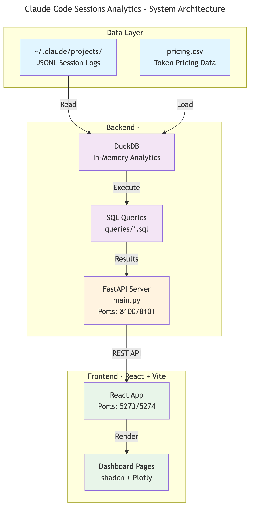

# Claude Code Sessions Analytics

FastAPI + React dashboard for visualizing Claude Code session usage and costs from `~/.claude/projects/` JSONL files using DuckDB.

## Architecture Diagrams

### Quick Overview

*High-level system components and data flow* | [Source](docs/diagrams/architecture-overview.mmd)

### Detailed Views

| Diagram | Description |
|---------|-------------|
| [Architecture](docs/diagrams/architecture-overview.png) | FastAPI + React + DuckDB components and relationships ([source](docs/diagrams/architecture-overview.mmd)) |
| [Data Flow](docs/diagrams/data-flow-overview.png) | Processing pipeline from JSONL files to visualizations ([source](docs/diagrams/data-flow-overview.mmd)) |
| [API Sequence](docs/diagrams/sequence-api.png) | Request/response flows for all API endpoints ([source](docs/diagrams/sequence-api.mmd)) |

## Quick Start

### Installation
```bash
make install              # Install all dependencies
```

### Development

**For AI Agents (use agentic ports):**
```bash
make agentic-dev          # Backend: 8101, Frontend: 5274
```

**For Human Developers:**
```bash
make dev                  # Backend: 8100, Frontend: 5273
```

### Data Management
```bash
make sync-projects        # Sync from ~/.claude/projects/
```

## Tech Stack

**Backend:**
- FastAPI - API framework
- DuckDB - Analytics database
- uv - Package management

**Frontend:**
- React 18 + TypeScript
- Vite - Build tool
- Tailwind CSS + shadcn/ui
- Plotly.js - Charts
- Lucide React - Icons

## Dashboard Features

- **Dashboard** - Summary cards, monthly cost trends
- **Hourly** - Heatmaps and polar charts (DoW � HoD) with Melbourne timezone
- **Daily** - Cost and token trends
- **Weekly** - Weekly breakdowns
- **Monthly** - Monthly analysis with model distribution
- **Projects** - Per-project usage statistics

## Port Configuration

| Developer | Backend | Frontend |
|-----------|---------|----------|
| Human     | 8100    | 5273     |
| AI Agent  | 8101    | 5274     |

**Important:** Always use agentic ports (8101/5274) when developing as an AI agent!

## Commands Reference

```bash
# Development
make dev                  # Human dev (8100/5273)
make agentic-dev          # AI agent dev (8101/5274)
make dev-backend          # Backend only
make dev-frontend         # Frontend only

# Code Quality
make format               # Format with ruff
make lint                 # Lint all code
make typecheck            # Type check all code
make test                 # Run all tests

# Port Management
make port-debug           # Show port usage
make port-clean           # Kill processes on ports

# Utilities
make clean                # Clean build artifacts
```

## Data Schema

Session JSONL files contain:
- `timestamp` - ISO8601 format (UTC, converted to Australia/Melbourne for analysis)
- `message.model` - Claude model ID
- `message.usage` - Token usage metrics
  - `input_tokens`, `output_tokens`
  - `cache_read_input_tokens`
  - `cache_creation_input_tokens`
  - `cache_creation.ephemeral_5m_input_tokens`

## Pricing

Model pricing is centralized in [`src/claude_code_sessions/pricing.py`](src/claude_code_sessions/pricing.py).

This module provides:
- `PRICING_TABLE` - List of all Claude model prices (per million tokens)
- `get_pricing_cte()` - Generates SQL CTE for use in queries

Pricing includes: base input, cache write (5m/1h), cache read, and output tokens.

Source: [Anthropic Pricing](https://www.anthropic.com/pricing)

## API Endpoints

- `GET /api/health` - Health check
- `GET /api/summary` - Overall usage summary
- `GET /api/usage/daily` - Daily breakdown
- `GET /api/usage/weekly` - Weekly breakdown
- `GET /api/usage/monthly` - Monthly breakdown
- `GET /api/usage/hourly` - Hourly breakdown (last 14 days, Melbourne timezone)
- `GET /api/usage/sessions` - Per-session details
- `GET /api/projects` - Projects with stats
- `GET /api/usage/top-projects-weekly` - Top 3 projects (last 8 weeks)

## Development Notes

- All Python code must pass mypy strict mode
- Use `@/` import alias in frontend (e.g., `@/hooks/useApi`)
- Frontend uses shadcn/ui components with Tailwind CSS
- Backend uses uv for dependency management (not pip/requirements.txt)
- Stay at repo root for all operations (use `npm --prefix frontend`)
