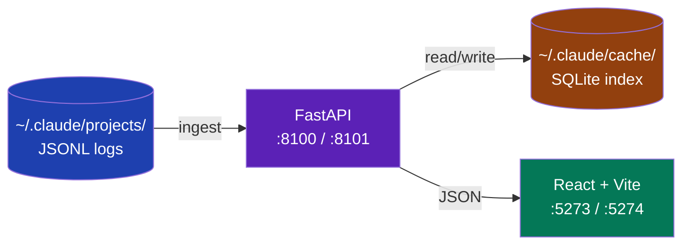
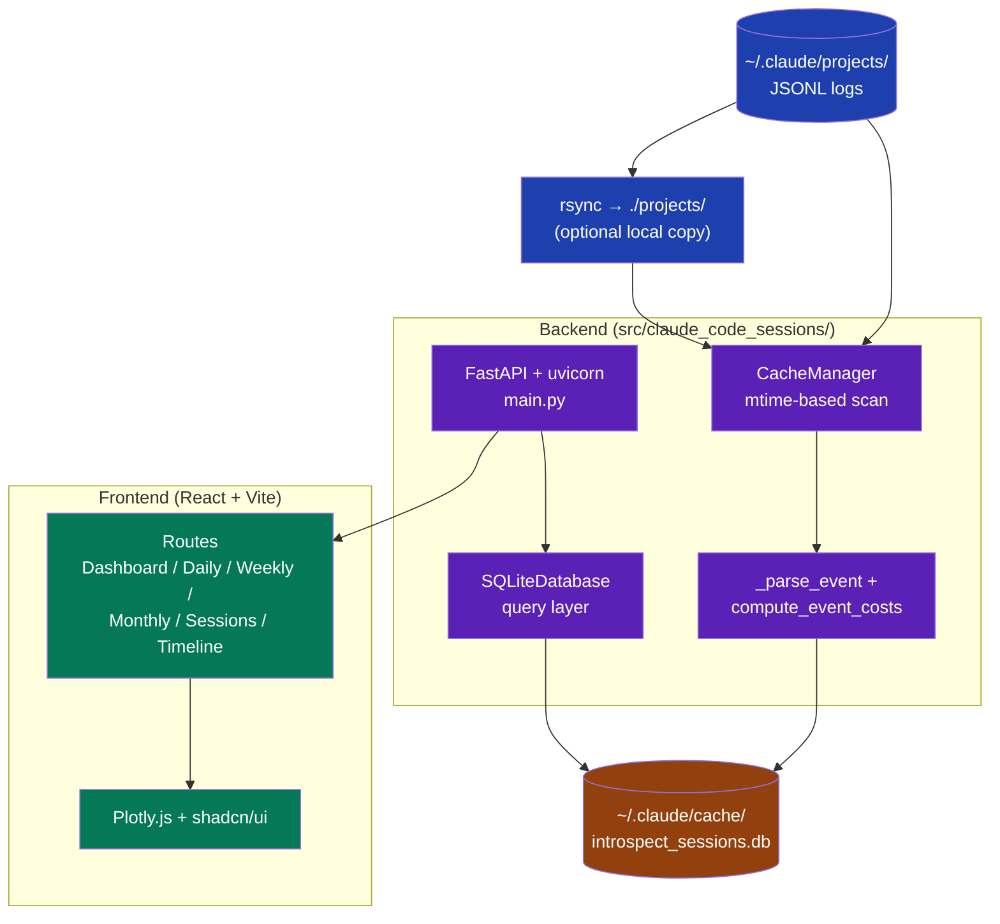
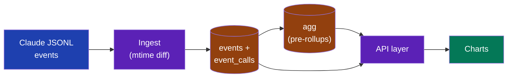
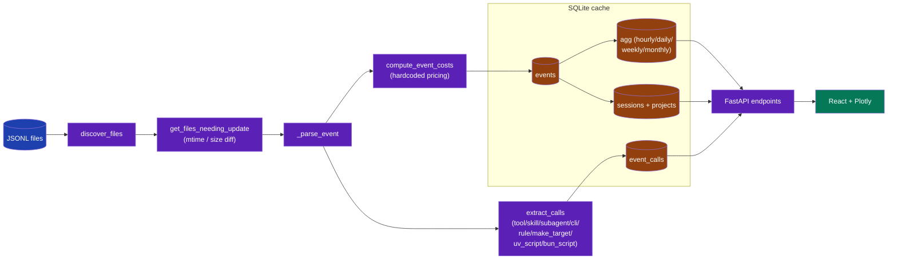
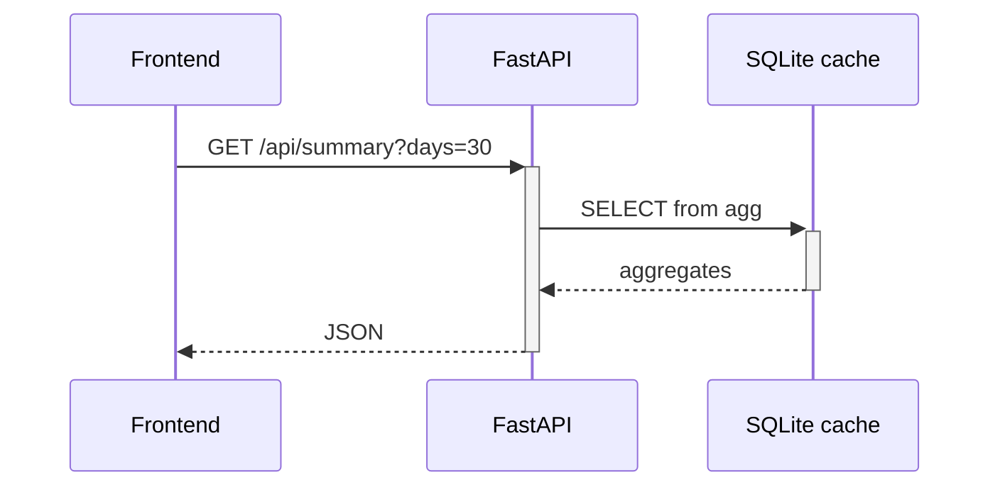
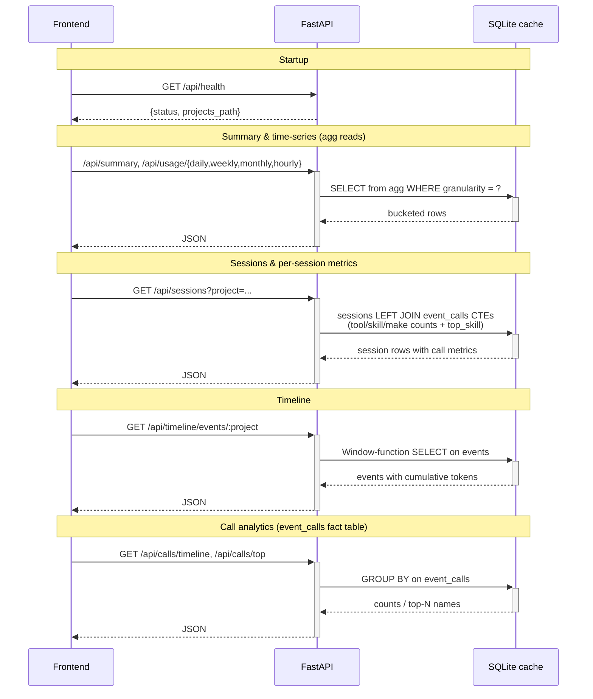

# Claude Code Sessions Analytics

FastAPI + React dashboard for visualizing Claude Code session usage and costs from `~/.claude/projects/` JSONL files, backed by an incrementally-built SQLite cache at `~/.claude/cache/introspect_sessions.db`.

## Architecture Diagrams

Each lens below has a simplified overview (always visible) and a detailed
reference (collapsed). Diagrams render natively on GitHub / GitLab — no
pre-rendered PNG step. Color encoding is consistent across all three:
🟦 source · 🟪 process · 🟧 storage · 🟩 output.

### System architecture


```mermaid
flowchart LR
    JSONL[("~/.claude/projects/<br/>JSONL logs")]:::source
    API["FastAPI<br/>:8100 / :8101"]:::process
    CACHE[("~/.claude/cache/<br/>SQLite index")]:::storage
    UI["React + Vite<br/>:5273 / :5274"]:::output

    JSONL -->|ingest| API
    API -->|read/write| CACHE
    API -->|JSON| UI

    classDef source  fill:#1e40af,color:#ffffff
    classDef storage fill:#92400e,color:#ffffff
    classDef process fill:#5b21b6,color:#ffffff
    classDef output  fill:#047857,color:#ffffff
```

*4 nodes — the end-to-end data path in one line.*

<details>
<summary>📋 Detailed architecture (subgraphs by responsibility)</summary>


```mermaid
flowchart TB
    JSONL[("~/.claude/projects/<br/>JSONL logs")]:::source
    RSYNC["rsync → ./projects/<br/>(optional local copy)"]:::source

    subgraph Backend["Backend (src/claude_code_sessions/)"]
        INGEST["CacheManager<br/>mtime-based scan"]:::process
        PARSE["_parse_event +<br/>compute_event_costs"]:::process
        DB["SQLiteDatabase<br/>query layer"]:::process
        API["FastAPI + uvicorn<br/>main.py"]:::process
    end

    CACHE[("~/.claude/cache/<br/>introspect_sessions.db")]:::storage

    subgraph Frontend["Frontend (React + Vite)"]
        ROUTES["Routes<br/>Dashboard / Daily / Weekly /<br/>Monthly / Sessions / Timeline"]:::output
        CHARTS["Plotly.js + shadcn/ui"]:::output
    end

    JSONL --> RSYNC
    JSONL --> INGEST
    RSYNC --> INGEST
    INGEST --> PARSE
    PARSE --> CACHE
    DB --> CACHE
    API --> DB
    API --> ROUTES
    ROUTES --> CHARTS

    classDef source  fill:#1e40af,color:#ffffff
    classDef storage fill:#92400e,color:#ffffff
    classDef process fill:#5b21b6,color:#ffffff
    classDef output  fill:#047857,color:#ffffff
```

</details>

### Data flow — JSONL to charts


```mermaid
flowchart LR
    S["Claude JSONL<br/>events"]:::source
    I["Ingest<br/>(mtime diff)"]:::process
    D[("events +<br/>event_calls")]:::storage
    AGG[("agg<br/>(pre-rollups)")]:::storage
    API["API layer"]:::process
    UI["Charts"]:::output

    S --> I --> D
    D --> AGG
    AGG --> API
    D --> API
    API --> UI

    classDef source  fill:#1e40af,color:#ffffff
    classDef storage fill:#92400e,color:#ffffff
    classDef process fill:#5b21b6,color:#ffffff
    classDef output  fill:#047857,color:#ffffff
```

*6 nodes — ingest writes to fact tables, a nightly rollup populates `agg` for fast time-series reads.*

<details>
<summary>📋 Detailed data flow (per-function pipeline)</summary>


```mermaid
flowchart LR
    S1[("JSONL files")]:::source
    DISC["discover_files"]:::process
    NEED["get_files_needing_update<br/>(mtime / size diff)"]:::process
    PARSE["_parse_event"]:::process
    COST["compute_event_costs<br/>(hardcoded pricing)"]:::process
    EXTRACT["extract_calls<br/>(tool/skill/subagent/cli/<br/>rule/make_target/<br/>uv_script/bun_script)"]:::process

    subgraph DB["SQLite cache"]
        EV[("events")]:::storage
        EC[("event_calls")]:::storage
        AGG[("agg (hourly/daily/<br/>weekly/monthly)")]:::storage
        SESS[("sessions + projects")]:::storage
    end

    API["FastAPI endpoints"]:::process
    UI["React + Plotly"]:::output

    S1 --> DISC --> NEED --> PARSE
    PARSE --> COST --> EV
    PARSE --> EXTRACT --> EC
    EV --> AGG
    EV --> SESS
    AGG --> API
    SESS --> API
    EC --> API
    API --> UI

    classDef source  fill:#1e40af,color:#ffffff
    classDef storage fill:#92400e,color:#ffffff
    classDef process fill:#5b21b6,color:#ffffff
    classDef output  fill:#047857,color:#ffffff
```

</details>

### API request/response flow


```mermaid
sequenceDiagram
    participant F as Frontend
    participant API as FastAPI
    participant DB as SQLite cache

    F->>+API: GET /api/summary?days=30
    API->>+DB: SELECT from agg
    DB-->>-API: aggregates
    API-->>-F: JSON
```

*The canonical read path — dashboard endpoints all follow this shape.*

<details>
<summary>📋 Detailed API flow (every endpoint family)</summary>


```mermaid
sequenceDiagram
    participant F as Frontend
    participant API as FastAPI
    participant DB as SQLite cache

    Note over F,DB: Startup
    F->>API: GET /api/health
    API-->>F: {status, projects_path}

    Note over F,DB: Summary & time-series (agg reads)
    F->>+API: /api/summary, /api/usage/{daily,weekly,monthly,hourly}
    API->>+DB: SELECT from agg WHERE granularity = ?
    DB-->>-API: bucketed rows
    API-->>-F: JSON

    Note over F,DB: Sessions & per-session metrics
    F->>+API: GET /api/sessions?project=...
    API->>+DB: sessions LEFT JOIN event_calls CTEs<br/>(tool/skill/make counts + top_skill)
    DB-->>-API: session rows with call metrics
    API-->>-F: JSON

    Note over F,DB: Timeline
    F->>+API: GET /api/timeline/events/:project
    API->>+DB: Window-function SELECT on events
    DB-->>-API: events with cumulative tokens
    API-->>-F: JSON

    Note over F,DB: Call analytics (event_calls fact table)
    F->>+API: GET /api/calls/timeline, /api/calls/top
    API->>+DB: GROUP BY on event_calls
    DB-->>-API: counts / top-N names
    API-->>-F: JSON
```

</details>

## Quick Start

### Installation
```bash
make install              # Install all dependencies
```

### Development

**For AI Agents (use agentic ports):**
```bash
make agentic-dev          # Backend: 8101, Frontend: 5274
```

**For Human Developers:**
```bash
make dev                  # Backend: 8100, Frontend: 5273
```

### Data Management
```bash
make sync-projects        # Sync from ~/.claude/projects/
```

## Tech Stack

**Backend:**
- FastAPI - API framework
- SQLite (stdlib `sqlite3`) - Cached analytics index, built incrementally from JSONL source files
- uv - Package management

**Frontend:**
- React 18 + TypeScript
- Vite - Build tool
- Tailwind CSS + shadcn/ui
- Plotly.js - Charts
- Lucide React - Icons

## Dashboard Features

- **Dashboard** - Summary cards, monthly cost trends, top skills / sub-agents / CLIs / make targets
- **Hourly** - Heatmaps and polar charts (DoW × HoD) with Melbourne timezone
- **Hour of Day** - Radial cost/token charts
- **Daily / Weekly / Monthly** - Diverging token bars by model with zero-aligned cost overlay
- **Sessions** - Per-session drill-down with message-kind filter
- **Timeline** - Event-level scatterplot per project

## Port Configuration

| Developer | Backend | Frontend |
|-----------|---------|----------|
| Human     | 8100    | 5273     |
| AI Agent  | 8101    | 5274     |

**Important:** Always use agentic ports (8101/5274) when developing as an AI agent!

## Commands Reference

```bash
# Development
make dev                  # Human dev (8100/5273)
make agentic-dev          # AI agent dev (8101/5274)
make dev-backend          # Backend only
make dev-frontend         # Frontend only

# Code Quality
make format               # Format with ruff
make lint                 # Lint all code
make typecheck            # Type check all code
make test                 # Run all tests

# Port Management
make port-debug           # Show port usage
make port-clean           # Kill processes on ports

# Utilities
make clean                # Clean build artifacts
```

## Data Schema

Session JSONL files contain:
- `timestamp` - ISO8601 format (UTC, converted to Australia/Melbourne for analysis)
- `message.model` - Claude model ID
- `message.usage` - Token usage metrics
  - `input_tokens`, `output_tokens`
  - `cache_read_input_tokens`
  - `cache_creation_input_tokens`
  - `cache_creation.ephemeral_5m_input_tokens`

## Pricing

Model pricing lives in [`src/claude_code_sessions/database/sqlite/pricing.py`](src/claude_code_sessions/database/sqlite/pricing.py) as a hardcoded dict keyed by model family (`opus`/`sonnet`/`haiku`). `compute_event_costs()` runs at ingest time and writes `total_cost_usd` directly onto each row of the SQLite `events` table — dashboard queries do plain `SUM(total_cost_usd)` with no runtime pricing lookup.

**Changing prices:** edit the dict, then rebuild the cache (bump `SCHEMA_VERSION` in `schema.py` or delete `~/.claude/cache/introspect_sessions.db`) so existing events get re-costed. The introspect skill at `.claude/skills/introspect/scripts/introspect_sessions.py` has its own copy of the same dict — keep in sync.

Source: [Anthropic Pricing](https://www.anthropic.com/pricing)

## API Endpoints

- `GET /api/health` - Health check
- `GET /api/summary` - Overall usage summary
- `GET /api/usage/daily` - Daily breakdown
- `GET /api/usage/weekly` - Weekly breakdown
- `GET /api/usage/monthly` - Monthly breakdown
- `GET /api/usage/hourly` - Hourly breakdown (last 14 days, Melbourne timezone)
- `GET /api/usage/sessions` - Per-session details
- `GET /api/projects` - Projects with stats (used for the sidebar project filter)
- `GET /api/usage/top-projects-weekly` - Top 3 projects (last 8 weeks)
- `GET /api/calls/timeline` - Tool/skill/sub-agent/CLI/make-target call counts bucketed by time
- `GET /api/calls/top` - Top-N distinct call names for a given call_type

## Development Notes

- All Python code must pass mypy strict mode
- Use `@/` import alias in frontend (e.g., `@/hooks/useApi`)
- Frontend uses shadcn/ui components with Tailwind CSS
- Backend uses uv for dependency management (not pip/requirements.txt)
- Stay at repo root for all operations (use `npm --prefix frontend`)
