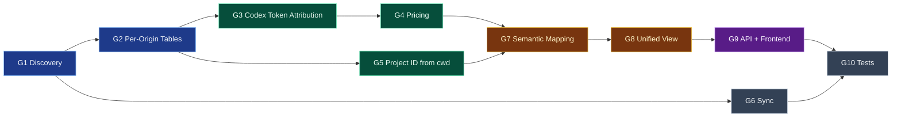
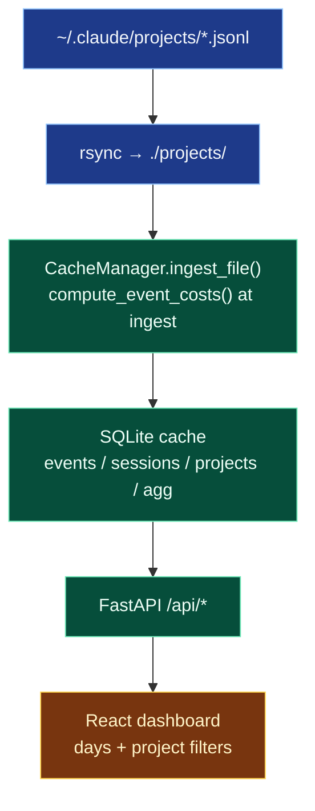
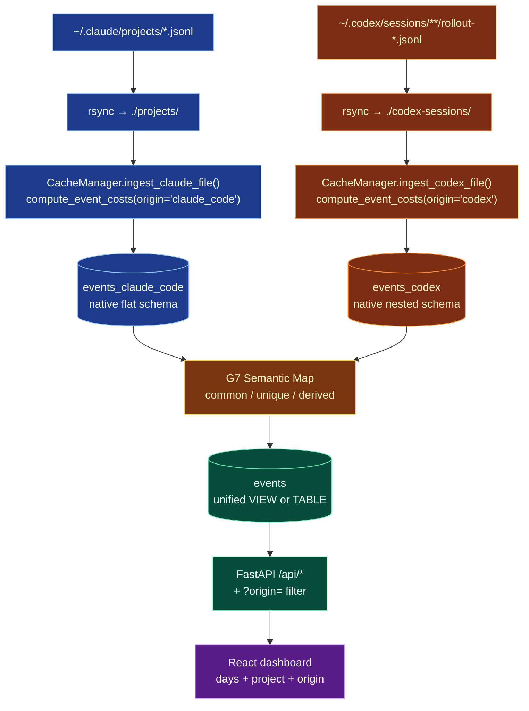
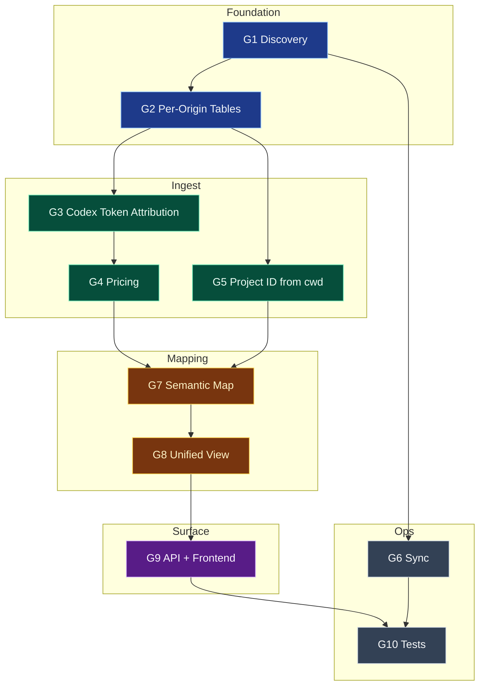

# Gap Analysis: Dual-Source Ingestion for Claude Code + Codex CLI Sessions

<!-- WARNING: External URLs (OpenAI/Anthropic pricing, CLI docs) not yet verified. Search for LINK_NOT_VERIFIED to review in Phase 3. -->

## 1. Overview

Today the project ingests **only** Claude Code JSONL sessions from `~/.claude/projects/`.
The goal is to extend ingestion, storage, pricing, and visualization to also cover
**OpenAI Codex CLI** sessions stored under `~/.codex/sessions/YYYY/MM/DD/rollout-*.jsonl`,
producing a unified dashboard that can show, filter, and compare usage and cost across
both origins.

### Design Principles

1. **No git-repo assumption.** A session is valid and must be tracked even if its
   `cwd` is not inside a git repository. Project identity derives from `cwd` only.
2. **Two parallel ingestion tables**, `events_claude_code` and `events_codex`, each
   in its native shape. No premature normalization. The ingestor remains schema-specific.
3. **`origin` discriminator lives on `source_files`** as the routing key that picks
   the right parser for each file. Per-origin tables don't need an `origin` column
   because they're physically separate.
4. **Semantic mapping is its own explicit phase.** Only after both per-origin tables
   are populated from real data do we catalog what is common, what is unique per
   origin, and what must be derived to fill gaps.
5. **Unified `events` view** is a read model built on top of the mapping — not a
   foundation assumed up front.

### Gap Index

- **G1** — File discovery from both source trees (Claude `~/.claude/projects/**`
  and Codex `~/.codex/sessions/YYYY/MM/DD/**`), tagging each file on `source_files`
  with `origin ∈ {'claude_code', 'codex'}`.
- **G2** — Per-origin event tables: `events_claude_code` (preserve today's `events`)
  and `events_codex` (native Codex shape). Each has its own incremental ingest.
- **G3** — Codex-specific token attribution: join out-of-band `event_msg.token_count`
  to the most recent `turn_context.model`, inside `events_codex` ingestion.
- **G4** — Pricing catalog extended with OpenAI model families so Codex cost
  is computed on the same **hypothetical-API-list-price** basis the project
  already uses for Claude. Subscription `plan_type` is recorded as a
  diagnostic label only; it does **not** adjust cost.
- **G5** — Project identity: `project_id = encode(session_meta.payload.cwd)`,
  fixed for the life of the session. Same encoding as Claude → two CLIs invoked
  in the same `cwd` resolve to the same `project_id`. Non-git `cwd` is
  first-class. Mid-session `turn_context.cwd` shifts are preserved per-event
  for drill-down but **do not** affect `project_id`.
- **G6** — Sync tooling: `make sync-codex` plus `make sync-all`; incremental and
  non-destructive like `sync-claude`.
- **G7** — Semantic mapping: empirical concept catalog (common vs unique vs
  derived) after both per-origin tables are populated with real data. This is
  a **deliverable of this plan**, not an architectural assumption.
- **G8** — Unified `events` view/table built **from** the G7 catalog, with
  derivation rules documented per column.
- **G9** — API + frontend surfacing: endpoints gain `?origin=` filter, UI
  gains origin filter chips. Per-origin drill-downs render native event types
  (Codex `function_call`, `reasoning`; Claude `tool_use`, `thinking`).
- **G10** — Test coverage: per-origin parser tests, semantic-map regression
  tests, unified-view contract tests, e2e origin-filter specs.

### Dependencies



---

## 2. Current State

The system treats "session data" as synonymous with "Claude Code JSONL" at every
layer — from file discovery to SQL column names to frontend labels.

### 2.1 Ingestion

- Discovery is hard-coded to `~/.claude/projects/` (with fallback to a local
  rsync mirror at `./projects/`), via `CacheManager.discover_files()`
  (`src/claude_code_sessions/database/sqlite/cache.py:81-114`).
- `make sync-projects` uses append-only `rsync -av ~/.claude/projects/ ./projects/`
  (`Makefile:193-198`).

### 2.2 Schema assumptions (Claude-only)

Every ingest path and SQL template assumes the Claude flat-event shape:

| Field | Path | Used at |
|---|---|---|
| event type | `type` | `session_parser.py:193` |
| session id | `sessionId` | `session_parser.py:239` |
| parent uuid | `parentUuid` | `session_parser.py:235` |
| model | `message.model` | `session_parser.py:216` |
| input tokens | `message.usage.input_tokens` | `session_parser.py:220`, `by_day.sql:26` |
| output tokens | `message.usage.output_tokens` | `session_parser.py:221`, `by_day.sql:27` |
| cache read | `message.usage.cache_read_input_tokens` | `by_day.sql:29` |
| 5-min cache write | `message.usage.cache_creation.ephemeral_5m_input_tokens` | `by_day.sql:30` |
| 1-hr cache write | `message.usage.cache_creation.ephemeral_1h_input_tokens` | `by_day.sql:31` |

### 2.3 Storage

- **SQLite cache** (`src/claude_code_sessions/database/sqlite/schema.py`) materializes
  a single `events` table (plus `sessions`, `projects`, `event_edges`, `event_calls`,
  and a dimensional `agg` table at hourly/daily/weekly/monthly grain). Schema
  version is 10. There is **no `origin` column** anywhere.
- The SQLite cache is the **single source of truth** — DuckDB has been
  removed; all API endpoints read from the incremental SQLite index.

### 2.4 Pricing

- Pricing is a hardcoded Python dict in
  `src/claude_code_sessions/database/sqlite/pricing.py`, keyed on
  `opus`/`sonnet`/`haiku`. `compute_event_costs()` runs at **ingest time**
  and writes `events.total_cost_usd` into the cache. Dashboard queries just
  `SUM(total_cost_usd)` — no runtime price lookup.
- Changing prices requires editing the dict **and** rebuilding the cache
  (bump `SCHEMA_VERSION` or delete the cache DB) so existing rows get
  re-costed.
- The introspect skill has its own identical copy of the dict at
  `.claude/skills/introspect/scripts/introspect_sessions.py` — must stay in
  sync.

### 2.5 API + frontend

- FastAPI endpoints in `src/claude_code_sessions/main.py` query the SQLite
  backend (`src/claude_code_sessions/database/sqlite/backend.py`) and return
  raw result dicts with no origin discriminator.
- `Layout.tsx` nav and `useFilters.ts` global filters (`?days=`, `?project=`)
  have no concept of origin.

### 2.6 Tests

- Backend pytest and frontend vitest use Claude-shaped fixtures exclusively.
- Playwright e2e walks UI flows that assume a single origin.



---

## 3. Desired State

Two independent ingestion pipelines populate two per-origin event tables that
preserve the native shape of each CLI's JSONL. A read-only unified view sits
above them, built from an empirical semantic map. The API and frontend gain
origin-awareness via filters and colour-coding.

### 3.1 Codex JSONL schema (derived from ad-hoc `duckdb` CLI probe against 9 local files, 350 events — used only for Phase-1 schema discovery, not part of the runtime)

Envelope: `{timestamp: ISO, type: string, payload: object}`.

Top-level `type` distribution:

| `type` | count | Role |
|---|---|---|
| `response_item` | 184 | OpenAI-API-shaped content. Inner `payload.type` ∈ `message`, `function_call`, `function_call_output`, `reasoning`, `custom_tool_call`, `custom_tool_call_output`. |
| `event_msg` | 133 | Side-channel UI/tool/status. Inner types include `token_count`, `exec_command_end`, `agent_message`, `user_message`, `agent_reasoning`, `task_started`, `task_complete`, `turn_aborted`, `patch_apply_end`, `error`. |
| `turn_context` | 22 | Per-turn settings. **Model ID lives here** at `payload.model`. |
| `session_meta` | 8 | One per session, first line. |
| `message` | 1 | Rare legacy shape. |

Key fields (union across CLI v0.38 and v0.121+):

- **session_meta.payload**: `id` (UUID), `timestamp`, `cwd`, `originator`
  (`codex_cli_rs` v0.38 → `codex-tui` v0.121+), `cli_version`, `model_provider`
  (v0.121+), `git.{commit_hash, branch, repository_url}` (v0.121+, nullable when
  cwd is not a repo), `instructions`.
- **turn_context.payload**: `cwd` (may shift mid-session), `approval_policy`,
  `sandbox_policy`, **`model`** (e.g. `"gpt-5-codex"`, `"gpt-5.4"`), `summary`.
- **event_msg.token_count.payload.info**:
  - `last_token_usage.{input_tokens, cached_input_tokens, output_tokens, reasoning_output_tokens, total_tokens}` — **per-call delta**.
  - `total_token_usage.{...}` — cumulative; redundant with sum-of-deltas.
  - `model_context_window`.
  - `rate_limits.{limit_id, primary, secondary, plan_type}` (v0.121+; e.g.
    `plan_type: "plus"` → ChatGPT subscription billing, per-token cost = $0).
- **event_msg.task_complete.payload**: `last_agent_message`, `duration_ms`.
- **event_msg.turn_aborted.payload**: `reason`, `duration_ms`.
- **response_item.message.payload**: `role ∈ {user, assistant, developer}`,
  `content[]` of `{type, text}`.
- **response_item.function_call.payload**: `name` (e.g. `exec_command`),
  `arguments` (JSON string), `call_id`.

### 3.2 Per-origin storage (no premature union)

Each origin gets its own SQLite table populated by its own parser:

- `source_files.origin TEXT NOT NULL CHECK(origin IN ('claude_code','codex'))`
  is the routing key.
- `events_claude_code` — rename of today's `events` table; schema unchanged.
  Preserves incremental ingest behaviour, all existing columns, indexes, and
  FKs into `source_files`, `event_edges`, `event_calls`, `sessions`, `projects`.
- `events_codex` — native Codex columns:
  - **Envelope**: `id` (synthetic PK), `source_file_id`, `line_number`,
    `timestamp`, `top_type` (`session_meta|turn_context|response_item|event_msg|message`),
    `payload_type` (e.g. `token_count`, `function_call`).
  - **Session** (constant per file, derived from `session_meta`):
    `session_id` (UUID from `session_meta.id`), `project_id`
    (`encode(session_meta.cwd)`, same encoder as Claude — see G5),
    `session_cwd` (raw `session_meta.cwd` string), `cli_version`,
    `originator`, `model_provider`, `git_commit_hash`, `git_branch`,
    `git_repo_url` (all nullable; display-only).
  - **Turn context (forward-filled from most recent `turn_context`,
    seeded from `session_meta`)**: `turn_cwd` (for drill-down, may
    differ from `session_cwd`), `turn_model`, `approval_policy`,
    `sandbox_mode`.
  - **Usage (populated only when `payload_type='token_count'`)**:
    - **Delta** (from `payload.info.last_token_usage`):
      `input_tokens`, `cached_input_tokens`, `output_tokens`,
      `reasoning_output_tokens`, `total_tokens`.
    - **Cumulative** (from `payload.info.total_token_usage`, stored per
      ADR-G3.1): `cumulative_input_tokens`,
      `cumulative_cached_input_tokens`, `cumulative_output_tokens`,
      `cumulative_reasoning_output_tokens`, `cumulative_total_tokens`.
    - **Context**: `model_context_window`.
    - **Diagnostic**: `subscription_plan` (label only; never feeds cost
      math — see ADR-G4.1), `rate_limit_primary_pct`,
      `rate_limit_secondary_pct`.
  - **Message (when `payload_type='message'`)**: `message_role`, `message_text_json`.
  - **Function call (when `payload_type='function_call'`)**: `fn_name`,
    `fn_arguments_json`, `fn_call_id`.
  - **Task outcome (when `payload_type ∈ {task_complete, turn_aborted}`)**:
    `duration_ms`, `termination_reason`, `last_agent_message`.
  - **Cost columns** (populated for `payload_type='token_count'`):
    `token_rate`, `billable_tokens`, `total_cost_usd`.
- `sessions_codex`, `projects_codex` — per-origin rollups mirroring the
  Claude counterparts. `sessions` and `projects` (existing tables) gain an
  `origin` column at a later pass (G9) once the unified view is validated.

### 3.3 Pricing

`pricing.csv` grows from `(model_family)` → `(origin, model_family)` with
rows for Anthropic's 3 families and OpenAI's gpt-5 / gpt-5-codex / o-series /
gpt-5.4. **Cost is always the hypothetical API list-price** for both origins
— the project does not model subscription billing on either side. The
dashboard answers "how much compute are you consuming, priced in API
dollars?" not "how much cash did you hand over this month?" This mirrors the
existing Claude Code posture (users on Max/Pro subscriptions still see
imputed API cost). `subscription_plan` is stored on `events_codex` as a
**diagnostic label only** (for a small Plus/Pro badge in session detail
views) and has **zero effect** on cost math.

### 3.4 Target architecture



---

## 4. Gap Analysis

### Gap Map



### Dependencies

See Overview Dependencies diagram.

---

### G1: File Discovery Across Two Source Trees

**Current**: `CacheManager.discover_files()`
(`src/claude_code_sessions/database/sqlite/cache.py:81-114`) resolves a
single `~/.claude/projects/` path. Each file tracked in `source_files` has
no provenance column.

**Gap**: Discover from two root paths, tag each file with its origin:
- Claude: `~/.claude/projects/<encoded-cwd>/<session-id>.jsonl`
- Codex: `~/.codex/sessions/YYYY/MM/DD/rollout-<ISO>-<uuid>.jsonl`

Incremental ingest must continue to work: mtime/size tracking is already in
`source_files`, so the only new thing is the `origin` routing column.

**Output(s)**:
- Modify `src/claude_code_sessions/database/sqlite/schema.py` — bump
  `SCHEMA_VERSION` from 10 → 11; add
  `origin TEXT NOT NULL CHECK(origin IN ('claude_code','codex')) DEFAULT 'claude_code'`
  to `source_files`; add index `idx_source_files_origin` on `(origin, mtime)`.
- Modify `src/claude_code_sessions/database/sqlite/cache.py:81-114`
  — `discover_files()` takes a list of `(origin, root_path, glob_pattern)` tuples;
  each `SourceFile` carries its origin through to insertion.
- Add to `src/claude_code_sessions/config.py` (Claude paths unchanged —
  preserve `PROJECTS_PATH = ./projects/`, `HOME_PROJECTS_PATH =
  ~/.claude/projects/`):
  ```python
  CODEX_HOME_PATH = Path("~/.codex/sessions").expanduser()
  CODEX_PATH = Path(os.environ.get("CODEX_PATH", "./codex-sessions"))
  ```

**References**:
- Codex filename regex:
  `rollout-\d{4}-\d{2}-\d{2}T\d{2}-\d{2}-\d{2}-[0-9a-f-]{36}\.jsonl`
- Codex glob: `**/????/??/??/rollout-*.jsonl`
- `origin` is the **only** column added to `source_files` in this gap; all other
  per-origin metadata lives on the respective event tables.

**ADRs**:
- **ADR-G1.1** (**RESOLVED**): Local-mirror layout. **Decision**: Claude
  keeps `./projects/` unchanged (zero churn for existing consumers);
  Codex mirrors to a sibling `./codex-sessions/` at repo root (name
  tracks the upstream directory `~/.codex/sessions/`). Each origin is
  configured by its own env var (`PROJECTS_PATH`, `CODEX_PATH`). A new
  entry `codex-sessions/` is added to `.gitignore`. **Rationale**: clean
  origin separation at the top level, no magic symlinks, no Claude-side
  breakage, upstream directory names preserved through the mirror so
  debugging is trivial (`ls ./codex-sessions/2026/04/20/`).
- **ADR-G1.2** (**RESOLVED**): Behaviour when one origin's root path is
  missing. **Decision**: log `INFO` ("no `~/.codex/sessions/` found —
  skipping Codex ingest") and continue with zero rows written for that
  origin. **Exception — both roots missing**: if **neither** Claude nor
  Codex resolves to a populated root, raise a clear `RuntimeError` at
  startup with the expected paths listed, because that state is
  unambiguously a misconfiguration. **Rationale**: a
  Claude-only developer should be able to run `make ci` without
  installing Codex, and vice versa; zero rows for one origin is an
  honest actionable state (empty dashboard section), not a failure.
  The "both missing" case is the only state where there is no
  meaningful data path and therefore the only state that should halt.

---

### G2: Per-Origin Event Tables

**Current**: One `events` table shaped to Claude's flat event, populated by
`_parse_event()` in `cache.py:184`.

**Gap**: Each origin needs its own ingest path and its own event table that
preserves native column semantics. No shared schema at this layer; no
`origin` column on the event tables themselves (it lives on `source_files`
and is joined when needed).

**Output(s)**:
- Rename today's `events` table to `events_claude_code` in
  `src/claude_code_sessions/database/sqlite/schema.py`. All existing indexes,
  FKs, and triggers move with it. **No compat view** (per ADR-G2.3) —
  in the same PR, update every reference to `events` across:
  - `src/claude_code_sessions/queries/*.sql` — every SQL template that
    today reads `FROM events` now reads `FROM events_claude_code`.
  - `src/claude_code_sessions/database/sqlite/cache.py` — aggregate
    rebuild, `refresh_aggregates_for_range()`, and any other internal
    SQL.
  - `.claude/skills/introspect/scripts/introspect_sessions.py` — its
    own SQL copies must match the rename; its hardcoded pricing dict
    stays in lockstep per MEMORY.md.
  - Any test fixtures or SQL assertions in `tests/`.
- Create `events_codex` table with columns listed in Section 3.2.
- Create new module
  `src/claude_code_sessions/parsers/codex_parser.py` — exposes
  `parse_codex_file(path: Path) -> Iterator[CodexEvent]`. All `json` and
  `pathlib` imports at top of file (per `.claude/rules/python/RULES.md`).
  The parser maintains forward-filled state `current_turn_model`,
  `current_turn_cwd`, `current_turn_approval`, `current_turn_sandbox`
  updated on each `turn_context` line.
- Refactor `src/claude_code_sessions/session_parser.py` — extract the Claude
  path into `src/claude_code_sessions/parsers/claude_parser.py` so both
  parsers are peers. Keep `SessionEvent` as the Claude-specific row type;
  add `CodexEvent` for Codex.
- In `CacheManager` (`cache.py`):
  - Split `ingest_file()` into `ingest_claude_file()` and `ingest_codex_file()`.
  - `update()` dispatches per `source_files.origin`.
  - Each path has its own `refresh_aggregates_for_range()` target table;
    these remain schema-specific until G8.
  - `ingest_codex_file()` **dual-writes** tool-call rows: native columns
    on `events_codex` **and** a parallel row in the existing `event_calls`
    table with `call_type ∈ {'codex_function', 'codex_exec'}`, per
    ADR-G2.4. Existing `event_calls` indexes on `(call_type, call_name)`
    and `(timestamp)` light up for Codex immediately.

**References**:

```python
# parsers/codex_parser.py — sketch of per-origin parser (no schema mapping yet)
from __future__ import annotations
import json
import logging
from dataclasses import dataclass
from pathlib import Path
from typing import Iterator

log = logging.getLogger(__name__)


@dataclass
class CodexEvent:
    line_number: int
    timestamp: str
    top_type: str
    payload_type: str | None
    session_id: str | None
    turn_cwd: str | None
    turn_model: str | None
    input_tokens: int
    cached_input_tokens: int
    output_tokens: int
    reasoning_output_tokens: int
    total_tokens: int
    subscription_plan: str | None
    message_role: str | None
    message_text_json: str | None
    fn_name: str | None
    fn_arguments_json: str | None
    duration_ms: int | None
    termination_reason: str | None
    last_agent_message: str | None
    raw_pointer: tuple[Path, int]


def parse_codex_file(path: Path) -> Iterator[CodexEvent]:
    current_turn_model: str | None = None
    current_turn_cwd: str | None = None
    session_id: str | None = None

    with path.open("r", encoding="utf-8") as fh:
        for line_no, line in enumerate(fh, start=1):
            if not line.strip():
                continue
            evt = json.loads(line)
            top = evt.get("type")
            payload = evt.get("payload") or {}
            ptype = payload.get("type") if isinstance(payload, dict) else None

            if top == "session_meta":
                session_id = payload.get("id")
                current_turn_cwd = payload.get("cwd")
                # yield a session-start event...
            elif top == "turn_context":
                current_turn_model = payload.get("model") or current_turn_model
                current_turn_cwd = payload.get("cwd") or current_turn_cwd
                # yield a turn-boundary event...
            elif top == "event_msg" and ptype == "token_count":
                info = payload.get("info") or {}
                delta = info.get("last_token_usage") or {}
                rl = payload.get("rate_limits") or {}
                yield CodexEvent(
                    line_number=line_no,
                    timestamp=evt["timestamp"],
                    top_type=top,
                    payload_type=ptype,
                    session_id=session_id,
                    turn_cwd=current_turn_cwd,
                    turn_model=current_turn_model,
                    input_tokens=delta.get("input_tokens", 0),
                    cached_input_tokens=delta.get("cached_input_tokens", 0),
                    output_tokens=delta.get("output_tokens", 0),
                    reasoning_output_tokens=delta.get("reasoning_output_tokens", 0),
                    total_tokens=delta.get("total_tokens", 0),
                    subscription_plan=rl.get("plan_type"),
                    message_role=None,
                    message_text_json=None,
                    fn_name=None,
                    fn_arguments_json=None,
                    duration_ms=None,
                    termination_reason=None,
                    last_agent_message=None,
                    raw_pointer=(path, line_no),
                )
            # ... other payload_types, preserving native columns
```

**ADRs**:
- **ADR-G2.1**: Codex `last_token_usage.input_tokens` — inclusive of
  `cached_input_tokens` or additive? Empirical check: a second-turn value
  of `input=3167, cached=3072` implies fresh=95 under the inclusive
  interpretation, which matches the short user-reply shape of a multi-turn
  conversation. Under additive it would be 3167 fresh tokens for a short
  reply, implausible. Maps cleanly to OpenAI's API convention where
  `prompt_tokens` includes `cached_tokens`. **Resolved: inclusive.** Compute
  `fresh_input = input_tokens - cached_input_tokens` at cost time.
- **ADR-G2.2** (**RESOLVED**): Forward-fill `turn_model` when a
  `token_count` arrives before any `turn_context` has been seen.
  **Decision**: assign sentinel `turn_model = "unknown_codex"`, log at
  `WARNING` once per file, surface the count in
  `/api/summary.unknown_models[]`. Never drop the event (token counts
  are preserved). **Rationale**: composes with ADR-G4.2 — the sentinel
  does not match any GPT-family prefix, so it naturally falls through to
  the locally-hosted cost-of-zero branch. That is the correct cost when
  we cannot determine the model (could have been gpt-5, could have been
  an Ollama-served model; guessing from `cli_version` is a silent
  fallback the fail-loud rule prohibits). The sentinel is visible in
  diagnostics so the user can backfill a manual override and rebuild the
  cache if they care about historical cost.
- **ADR-G2.3** (**RESOLVED**): Legacy `events` view during the G2→G8
  transition. **Decision**: **no compat view** — rename eagerly. The G2
  PR updates every SQL query in `src/claude_code_sessions/queries/*.sql`
  to reference `events_claude_code` explicitly (Claude origin only; they
  are all Claude queries today), and the same PR updates the introspect
  skill's own SQL copies at
  `.claude/skills/introspect/scripts/introspect_sessions.py` so its
  hardcoded pricing dict and query strings stay in lockstep. **Rationale**:
  eliminates a window where a phantom `events` table exists as a view
  over only one origin (confusing state); enforces the "per-origin
  tables, no premature union" discipline from day one; defers the
  unified-view structural decision cleanly to G8 where it belongs. The
  larger G2 PR is acceptable because the rename is mechanical — the
  blast radius is all grep-and-replace, not semantic changes.
- **ADR-G2.4** (**RESOLVED**): Codex `function_call` / `exec_command`
  events are stored **both** inline on `events_codex` (native columns
  `fn_name`, `fn_arguments_json`, `fn_call_id`) **and** mirrored into
  the existing `event_calls` table with new `call_type` values
  `codex_function` and `codex_exec`. **Decision**: dual-write at ingest
  time in `ingest_codex_file()`. **Rationale**: `event_calls` is already
  a generic dimensional table (`call_type`, `call_name`, `timestamp`,
  `project_id`, `session_id`) with no Claude-specific semantics; adding
  two new `call_type` values is purely additive. This means the existing
  call-timeline and top-tools endpoints work across both origins
  immediately, with no G9 UI changes needed for Codex drill-downs. If
  G7's semantic mapping later identifies meaningful differences between
  the two tool models, we can split at that point — but the base
  analytics are free right now.

---

### G3: Codex-Specific Token Attribution

**Current**: N/A — Codex ingestion does not yet exist.

**Gap**: Codex's `token_count` events are **out of band** — they arrive
after some number of `response_item`s and refer to the most recent model
set by the most recent `turn_context`. A session that switches models
mid-conversation must correctly attribute tokens to the model active at
each `token_count` boundary.

**Output(s)**:
- In `parsers/codex_parser.py` (G2), maintain `current_turn_model` as a
  closure variable updated on every `turn_context`. Emit every
  `token_count` event with `turn_model = current_turn_model`.
- In `src/claude_code_sessions/database/sqlite/cache.py` (G2 split),
  the Codex ingest path writes `token_rate`, `billable_tokens`,
  `total_cost_usd` inline, reusing the per-origin pricing computation
  from G4.

**References**:
- Attribution happens in Python during
  `parse_codex_file()`, not in SQL — the parser maintains
  `current_turn_model` as a closure variable (see G2 parser sketch) and
  stamps every `token_count` event with the model active at its
  timestamp. No ASOF-style SQL join needed because the cache is
  populated row-by-row at ingest.

**ADRs**:
- **ADR-G3.1** (**RESOLVED**): Store cumulative `total_token_usage`
  **alongside** `last_token_usage` deltas. **Decision**: `events_codex`
  gets both sets of columns — delta (no prefix) and cumulative
  (`cumulative_` prefix) — populated from the two objects on each
  `token_count` event. **Rationale**: storage is cheap; preserving both
  enables reconciliation checks (`cumulative_X at event N == SUM(delta_X)
  over events 1..N within session`) as a data-integrity signal for
  upstream Codex bugs, dropped events, or double-ingested rows. The
  broader principle — **err on the side of storing raw signal** — also
  applies to other "derive-vs-persist" tradeoffs later in this plan.
  A drift between delta and cumulative is a diagnostic event we want
  loudly visible, not a redundancy we tried to avoid by discarding.
- **ADR-G3.2** (**RESOLVED**): Token counts on sessions that have
  **zero** `turn_context` events (older CLI). **Decision**: same
  treatment as ADR-G2.2 — every such `token_count` event is emitted with
  `turn_model = "unknown_codex"`, tokens recorded, cost = 0 via the
  ADR-G4.2 locally-hosted fallback. **Rationale**: one rule, one
  sentinel, one diagnostic surface — no special code path for the
  "entire session has no turn_context" case vs the "token_count arrives
  before any turn_context" case; both are the same absence.

---

### G4: Pricing Catalog Extension

**Current**: `src/claude_code_sessions/data/pricing.csv` has 3 rows
(`opus`, `sonnet`, `haiku`). `pricing.py:model_family()` checks for
opus/sonnet/haiku substrings. SQL templates embed the same `LIKE` CASE.

**Gap**: Extend to OpenAI families; add per-origin dispatch; handle
`subscription_plan → $0` semantics.

**Output(s)**:
- Rewrite `pricing.csv` with composite key `(origin, model_family)`:
  ```csv
  origin,model_family,base_input_price,cache_read_price,cache_write_5m_price,cache_write_1h_price,output_price
  claude_code,opus,15.00,1.50,18.75,30.00,75.00
  claude_code,sonnet,3.00,0.30,3.75,6.00,15.00
  claude_code,haiku,1.00,0.10,1.25,2.00,5.00
  codex,gpt-5,1.25,0.125,,,10.00
  codex,gpt-5-codex,1.25,0.125,,,10.00
  codex,gpt-5-mini,0.25,0.025,,,2.00
  codex,gpt-5-nano,0.05,0.005,,,0.40
  codex,gpt-5.4,1.25,0.125,,,10.00
  codex,o1,15.00,7.50,,,60.00
  codex,o3,2.00,0.50,,,8.00
  ```
  <!-- ASSUMPTION: OpenAI prices are representative pending Phase 3 verification -->
  <!-- LINK_NOT_VERIFIED: https://openai.com/pricing -->
  <!-- LINK_NOT_VERIFIED: https://www.anthropic.com/pricing -->
- Split `src/claude_code_sessions/database/sqlite/pricing.py` into:
  - `claude_model_family(model_id) -> str` (existing logic).
  - `codex_model_family(model_id) -> str` (prefix/contains match).
  - `compute_event_costs(origin, model_id, *, input_tokens, output_tokens,
    cache_read_tokens, cache_creation_tokens=0, reasoning_tokens=0) ->
    (rate, billable, cost)` — dispatches on `origin`. For Codex:
    `fresh_input = input - cache_read_tokens`,
    `cost = (fresh_input*base + cache_read*cache_read_rate +
    output*output_rate) / 1e6`. **Subscription plan is NOT a parameter**
    — cost is always list-price, consistent with the Claude path's
    existing behaviour.
- Cost is computed **at ingest** in `compute_event_costs()` and written
  to `events_codex.total_cost_usd`. Dashboard queries read the
  precomputed value; no per-query pricing join is introduced (preserves
  the existing SQLite-cache pattern).

**ADRs**:
- **ADR-G4.1** (**RESOLVED**): Cost model for Codex sessions is the same
  "hypothetical API list-price" posture the project already uses for
  Claude. **Decision**: `compute_event_costs()` never consults
  `subscription_plan`; it always produces list-price cost.
  `subscription_plan` is stored on `events_codex` purely as a diagnostic
  label (for a small Plus/Pro badge in session drill-down views). No
  second `imputed_api_cost_usd` column, no UI toggle, no subscription
  math branch. **Rationale**: consistency with the existing Claude
  behaviour (Max/Pro subscribers see imputed cost today) keeps the
  dashboard's narrative coherent — it answers "how much compute are you
  consuming, in API dollars?" for every user, every origin.
- **ADR-G4.2** (**RESOLVED**): Unknown-model dispatch policy.
  **Decision**: two-tier fallback:
  1. **Model ID matches OpenAI naming** (contains `gpt-`, `o1`, `o3`,
     `gpt-5`, etc. — match via a prefix/substring whitelist in
     `codex_model_family()`): substitute the **nearest known GPT family**
     as a best-effort price (default: `gpt-5` rates). Surface in
     `/api/summary.imputed_model_families[]` so the operator sees
     "we priced `gpt-6` as if it were `gpt-5`" and can add a real CSV row.
  2. **Model ID does not match OpenAI naming** (e.g. `llama3:70b`,
     `qwen2.5-coder:32b`, anything Ollama serves): assume locally-hosted,
     `cost_usd = 0.0`. This is the **correct answer**, not a silent
     fallback — a self-hosted model has no API cost.
  **Rationale**: the user frequently wires Codex to a local Ollama base
  URL and runs against self-hosted models; those sessions have real $0
  cost and the dashboard should reflect that honestly. A loud "unknown"
  sentinel would be noise for the common case. GPT-family unknowns still
  get the imputed-best-effort treatment consistent with the project's
  "hypothetical API list-price" posture (ADR-G4.1).
- **ADR-G4.3**: Cache-write columns are empty for Codex rows (OpenAI
  doesn't bill cache writes separately). <!-- UNRESOLVED -->
  **Recommendation**: allow empty/null; cost formula treats null as zero.

---

### G5: Project Identity from Initial `cwd`

**Current**: Claude `project_id` is the encoded cwd directory name
(`-Users-joshpeak-play-myproj`). `project_resolver.py:121-156`
authoritative source is `<project_dir>/sessions-index.json`.
`config.py:extract_domain()` splits the encoded name.

**Gap**: Codex stores the initial `cwd` on `session_meta.payload.cwd`
(first line of every file) and subsequent `turn_context.payload.cwd`
values (which may shift during a session). We want:
- `project_id = encode(session_meta.payload.cwd)`, **fixed for the life
  of the session** — mirrors Claude, where the directory placement at
  file-creation time commits each session to exactly one project.
- Same encoding function as Claude, so two CLIs invoked in the same cwd
  resolve to the same `project_id` and merge naturally in rollups.
- Mid-session `turn_context.cwd` values **preserved** on each event row
  (column `turn_cwd` on `events_codex`) for drill-down purposes, but they
  do **not** change `project_id`.
- No git-repo assumption. Non-git cwd is a first-class project.

**Output(s)**:
- Modify `src/claude_code_sessions/project_resolver.py` — add
  `encode_cwd_to_project_id(cwd: str) -> str` that applies Claude's
  path-to-id transform (`/Users/joshpeak/play/foo` → `-Users-joshpeak-play-foo`).
  Single canonical encoder used by both parsers.
- In `parsers/codex_parser.py`, compute `project_id` **once** from
  `session_meta.payload.cwd`, attach it to every `CodexEvent` emitted
  for that file. `turn_cwd` column on each event captures
  `turn_context.cwd` (forward-filled from the most recent `turn_context`,
  initialized to `session_meta.cwd`) for drill-down only.
- `extract_domain()` (`config.py:29-48`) unchanged — encoded cwd starts
  with `-Users-<user>-<domain>-...` on both origins.
- Fallback for malformed files without `session_meta`: use first
  `turn_context.cwd` seen; if that is also absent, use
  `project_id = "__unknown_codex__"` and surface in diagnostics
  (consistent with the G3 unknown-model sentinel pattern).
- Explicitly **do not** consult `git.repository_url` for identity. If
  `session_meta.payload.git` is present, record `git_commit_hash`,
  `git_branch`, `git_repo_url` on `events_codex` for display / drill-down
  only — never as merge keys.

**ADRs**:
- **ADR-G5.1** (**RESOLVED**): Use initial `session_meta.cwd` as the
  project anchor for the whole session. Mid-session `turn_context.cwd`
  shifts are preserved per-event but do not affect `project_id`.
  **Rationale**: mirrors Claude's "one session, one project" model
  (filesystem-level in Claude, data-level in Codex); collapses
  session:project to N:1 on both sides; avoids a JSON-array projects
  column on `sessions_codex`; makes cross-origin rollup trivial
  (identical encoder, identical keys).
- **ADR-G5.2** (**RESOLVED**): Non-git cwd is first-class. No filter, no
  special casing. Encoded cwd is the id; UI renders it like any other
  project. **Rationale**: user explicitly requires sessions in non-git
  folders to be tracked.

---

### G6: Sync Tooling

**Current**: `make sync-projects` → `rsync -av ~/.claude/projects/ ./projects/`.
`make sync-watch` polls every 15s.

**Gap**: Same pattern for Codex, plus a combined target.

**Output(s)**:
- Modify `Makefile`:
  - Keep `sync-projects` exactly as-is (Claude, → `./projects/`).
  - Add `sync-codex` → `rsync -av ~/.codex/sessions/ ./codex-sessions/`.
  - Add `sync-all` → depends on `sync-projects sync-codex`.
  - Update `sync-watch` to invoke `sync-all`.
  - Add `compare-codex` diff helper (mirror of `compare-projects`).
- Add `codex-sessions/` entry to `.gitignore`.

**ADRs**:
- **ADR-G6.1** (**RESOLVED**): Inside `./codex-sessions/`, preserve the
  upstream `YYYY/MM/DD/rollout-*.jsonl` structure exactly (no flattening
  or session-id subfoldering). **Rationale**: zero transform, trivial
  rsync semantics, upstream-vs-mirror diffs are byte-for-byte comparable.

---

### G7: Semantic Mapping (Empirical Catalog)

**Current**: N/A — this is a new investigation, only possible once G2-G5
have populated real data in both per-origin tables.

**Gap**: Before building a unified view, we must empirically catalog
every column in both `events_claude_code` and `events_codex`, labelling
each as:

| Label | Meaning |
|---|---|
| **common** | Same concept, directly map (e.g. `timestamp`, `session_id`, `input_tokens`, `output_tokens`). |
| **unique** | Origin-specific, has no counterpart (e.g. Codex `reasoning_output_tokens`, Claude `cache_creation_ephemeral_5m_input_tokens`, Codex `subscription_plan`). |
| **derived** | Concept exists on both but one side needs computation to produce it (e.g. Claude has `message.model` per-event; Codex has it forward-filled from `turn_context`). |
| **lost** | Concept exists on one side but would be meaningless to expose on the unified view (e.g. Codex `approval_policy`). |

**Output(s)**:
- Write `docs/plans/codex-sessions-semantic-map.md` — a living table that
  catalogs every column in both tables. Committed to the repo; reviewed
  before G9 begins.
- Structure:
  ```markdown
  | concept | claude_code column | codex column | label | derivation / notes |
  |---|---|---|---|---|
  | timestamp | events_claude_code.timestamp | events_codex.timestamp | common | identical ISO strings |
  | input_tokens | events_claude_code.input_tokens | events_codex.input_tokens - events_codex.cached_input_tokens | derived | Codex input is prompt-total; subtract cached to get fresh |
  | cache_read_tokens | events_claude_code.cache_read_tokens | events_codex.cached_input_tokens | common | rename only |
  | reasoning_tokens | — | events_codex.reasoning_output_tokens | unique (Codex) | null for Claude; exposed as separate column in unified view |
  | cache_creation_tokens | events_claude_code.cache_creation_tokens | — | unique (Claude) | null for Codex |
  | subscription_plan | — | events_codex.subscription_plan | unique (Codex) | null for Claude |
  | model_id | events_claude_code.model_id | events_codex.turn_model | derived | Codex needs forward-fill |
  | project_id | events_claude_code.project_id | events_codex.project_id | common | same encoding (G5) |
  ...
  ```
- One row per concept, both tables fully enumerated. Reviewed as a PR
  before G9 schema design starts.

**ADRs**:
- **ADR-G7.1**: Where to keep the semantic map — markdown table in repo vs
  a machine-readable YAML/JSON driving automatic schema generation.
  <!-- UNRESOLVED -->
  **Recommendation**: markdown first (review-friendly); if G8 proves the
  map stable, mechanize later.
- **ADR-G7.2**: Handling "lost" concepts — drop them from the unified view
  entirely, or surface under a JSON `extra` column? <!-- UNRESOLVED -->
  **Recommendation**: JSON `extra` column per origin; keeps the unified
  view slim but preserves drill-down access.

---

### G8: Unified `events` View/Table

**Current**: N/A — depends on G7 catalog.

**Gap**: Build the read-only unified view (or materialized table) driven by
the mapping from G7. Columns are named after the **common** concepts; each
row carries an `origin` column; **unique** concepts appear as
nullable-on-the-other-origin columns; **derived** concepts are computed
per-origin in the view definition.

**Output(s)**:
- `src/claude_code_sessions/database/sqlite/unified_view.sql` — `CREATE VIEW events AS` with a UNION ALL over both per-origin tables, every `SELECT` listing columns in the same order, with explicit `NULL AS <unique_col>` on the origin that lacks a given concept.
- Decision: view vs materialized table — defer to ADR-G9.1 based on query
  latency measured at end of G8.
- Replace the G2 compat view (`CREATE VIEW events AS SELECT * FROM
  events_claude_code`) with this unified view atomically.
- Update `sessions`, `projects` tables — add `origin` column; rollup logic
  reads from the unified view (or per-origin table for incremental updates).

**ADRs**:
- **ADR-G8.1**: SQLite view vs materialized table for `events`.
  <!-- UNRESOLVED -->
  **Recommendation**: start as view. If `/api/summary` p95 > 500ms with
  both origins populated, promote to materialized table with triggers on
  `events_claude_code` / `events_codex` inserts.
- **ADR-G8.2**: `sessions` and `projects` rollup — rebuild from the
  unified view or maintain per-origin tables then union? <!-- UNRESOLVED -->
  **Recommendation**: per-origin `sessions_claude_code` and
  `sessions_codex`, unified `sessions` view. Same for `projects`. Keeps
  incremental ingestion simple.

---

### G9: API + Frontend Surfacing

**Current**: 16+ endpoints, none origin-aware. Global filters in
`useFilters.ts` are `?days=` and `?project=`.

**Gap**: Every endpoint gains an optional `?origin=` filter. Responses
include `origin` in list-shaped payloads. Frontend adds an origin chip to
global filters. Session detail pages render native event types
(Codex `function_call`, `reasoning`; Claude `tool_use`, `thinking`).

**Output(s)**:
- Modify `src/claude_code_sessions/main.py` — every `/api/*` endpoint
  that accepts `days` and `project` also accepts `origin: str | None = None`.
- Modify every SQL template — `WHERE (:origin IS NULL OR origin = :origin)`
  (queries now read from unified view).
- Modify `frontend/src/hooks/useFilters.ts` — extend filter triplet to
  `{days, project, origin}`. Default `origin = 'all'` omits the param.
  `filterSearchString` includes `origin`.
- Modify `frontend/src/components/Layout.tsx` — origin selector with
  colour-coded chips (Claude = blue, Codex = orange).
- Modify `frontend/src/lib/api-client.ts` — typed `origin` param on every
  method.
- Modify Plotly charts in `frontend/src/pages/*` — colour-segment by
  origin when the active filter is `all`.
- Add `frontend/src/components/session/CodexEventRenderers/` — renderers
  for `function_call`, `reasoning`, `exec_command_end`, `patch_apply_end`.

**ADRs**:
- **ADR-G9.1**: Default origin on first dashboard load. <!-- UNRESOLVED -->
  **Recommendation**: `all` — least surprising.
- **ADR-G9.2** (**RESOLVED**): Subscription cost display. **Decision**:
  identical to Claude — show imputed API cost, no toggle, no special
  zeroing. Add a small Plus/Pro/Team badge next to sessions whose
  `subscription_plan` is non-null, purely for context, so the user
  remembers "this was a subscription-billed session" when reading the
  imputed-cost number. **Rationale**: mirrors ADR-G4.1; zero new UI
  concepts beyond the badge.

---

### G10: Test Coverage

**Current**: Backend pytest + frontend vitest + Playwright e2e, all
Claude-only.

**Gap**: Tests for each preceding gap.

**Output(s)**:
- `tests/fixtures/codex_session_v038.jsonl` — older CLI (no `git`, no
  `model_provider`, no `rate_limits`).
- `tests/fixtures/codex_session_v121.jsonl` — current CLI with all
  richer fields.
- `tests/fixtures/codex_session_non_git.jsonl` — cwd in a non-git folder.
- `tests/fixtures/codex_session_model_switch.jsonl` — two `turn_context`
  events with different models.
- `tests/fixtures/codex_session_plus.jsonl` — `rate_limits.plan_type =
  "plus"`.
- `tests/test_codex_parser.py` — parametric per-fixture tests: token
  attribution, model forward-fill, subscription detection, cwd shift
  handling, unknown-model sentinel.
- `tests/test_pricing_dispatch.py` — parametric `(origin, model, plan) →
  expected cost` tests covering Claude + Codex + subscription zero.
- `tests/test_semantic_map_integrity.py` — run G8's map as a
  machine-checkable assertion: every column in each per-origin table is
  listed in the map with a non-null label.
- `tests/test_unified_view_contract.py` — after populating both fixtures,
  assert the unified `events` view rowcount equals
  `rows(events_claude_code) + rows(events_codex)` and that
  origin-filtered counts partition correctly.
- `frontend/e2e/origin-filter.spec.ts` — Playwright: toggle origin
  filter, assert URL changes, assert project list changes, assert
  chart segments recolour.
- Extend `frontend/src/lib/api-contract.test.ts` — assert every list
  response includes `origin`; assert `?origin=codex` returns only
  origin='codex' rows.

**ADRs**: none identified yet.

---

## 5. Success Measures

### Project Quality Bar (CI Gates)

All gates must pass before this feature ships:

| Gate | Command | Enforcement |
|---|---|---|
| Python type check | `make typecheck` | mypy strict, zero errors |
| Python lint | `make lint` | ruff, zero warnings |
| Frontend type check | `make typecheck` | tsc `--noEmit`, zero errors |
| Frontend lint | `make lint` | eslint, zero warnings |
| Backend tests | `make test-backend` | all pass including new Codex tests |
| Frontend unit | `make test-frontend` | all pass |
| API contract | `make test-contract` | per-origin rollups partition cleanly; unified view counts equal sum of per-origin table counts |
| e2e | `make test-frontend-e2e` | all flows including origin toggle |
| Combined | `make ci` | all above, green |

### Domain-Specific Measures

- **G1**: `SELECT COUNT(*) FROM source_files WHERE origin='codex'` > 0
  after `make sync-codex` against a populated `~/.codex/sessions/`.
  Returns 0 silently (no exception) when the tree is absent.
- **G2**: After ingest, `events_claude_code` and `events_codex` are both
  non-empty; `events_claude_code` row count exactly matches the count
  from the pre-change schema (regression check).
  `SELECT COUNT(*) FROM event_calls WHERE call_type IN ('codex_function',
  'codex_exec')` > 0 when Codex sessions with tool calls are ingested;
  the count equals the number of `response_item.function_call` events
  in those sessions (dual-write verification per ADR-G2.4).
- **G3**: For every Codex fixture session,
  `SUM(input_tokens + output_tokens) FROM events_codex WHERE session_id=?`
  equals the session's final `total_token_usage.total_tokens` (±1
  rounding tolerance). Additionally (per ADR-G3.1), the reconciliation
  invariant holds: on every `token_count` row,
  `cumulative_total_tokens` equals the running `SUM(total_tokens)` over
  prior rows in that session — any drift is surfaced as a loud
  diagnostic.
- **G4**: `total_cost_usd` for a Codex session with `subscription_plan =
  'plus'` is **equal to** the imputed API list-price cost for the same
  token counts — identical to what a non-subscription session with the
  same tokens would produce. (Cost is invariant to plan.) Unknown models
  surface in `/api/summary.unknown_models[]` with a non-zero count and
  `cost_usd = NULL` on their event rows.
- **G5**: A project with both Claude and Codex sessions in the same
  `cwd` resolves to **one `project_id`** and appears as a single row in
  `/api/projects` with summed cost. Every row in `events_codex` for a
  given `session_id` has the **same** `project_id` (derived from the
  file's `session_meta.cwd`), regardless of any mid-session
  `turn_context.cwd` shifts. Non-git cwd projects are first-class (not
  filtered out).
- **G6**: `make sync-all` exits 0 with both `./projects/` (Claude) and
  `./codex-sessions/` (Codex) populated; running it twice in a row is a
  no-op (no deletions, no byte changes on unchanged files).
- **G7**: `docs/plans/codex-sessions-semantic-map.md` exists and every
  column in `events_claude_code` and `events_codex` appears in exactly
  one row with a non-null label.
- **G8**: `SELECT COUNT(*) FROM events` (unified view) equals
  `(SELECT COUNT(*) FROM events_claude_code) + (SELECT COUNT(*) FROM
  events_codex)`.
- **G9**: Toggling the origin chip in the UI updates `?origin=` in the
  URL; reload preserves the filter; project dropdown, charts, and tables
  all respect the filter.
- **G10**: `make ci` green on a clean checkout with both fixture trees
  present.

---

## 6. Negative Measures

### Quality Bar Violations (Type 2 Failures — "looks done but isn't")

- **Silent drop** of Codex events because the parser encounters an
  unknown `payload_type` and skips it without logging. Must emit a
  `WARNING` per unknown type; test asserts log output contains the
  warning.
- **Graceful degradation**: an ImportError for a Codex-parser dependency
  is caught and Codex ingestion is silently disabled. Forbidden per the
  global fail-loud rule — imports live at module top, errors surface
  immediately.
- **Schema drift**: new Codex CLI version introduces a new `payload.type`;
  parser silently yields zero events for it. Test asserts at least one
  `WARNING` exists for any unknown inner type.
- **Double-count**: the Codex parser emits a usage event for every
  `response_item.message` AND for every `event_msg.token_count`.
  Integration test: summed `events_codex.total_cost_usd` equals one
  independently-computed figure derived from the fixture's final
  `total_token_usage` cumulative total times the known price.
- **Origin-leak at cache invalidation**: `SCHEMA_VERSION` bump to 11 does
  not drop/rebuild stale `agg` rows; dashboard shows pre-migration
  rollups. Test: after bump, `sessions`/`projects`/`agg` row counts
  derive from the new per-origin tables only.
- **Claude regression**: changes to the shared `source_files` schema
  break existing Claude ingest. Regression test: running the full pytest
  suite with only `~/.claude/projects/` populated produces identical
  results to the pre-change baseline.

### Domain-Specific Failures

- **G2 (per-origin tables)**: `events_codex` columns drift from the
  parser's output (someone adds a column to the table but forgets the
  parser, or vice versa). Test: parametric "parse fixture → compare
  columns" asserts shape equality.
- **G3 (token attribution)**: `token_count` event before any
  `turn_context` silently attributes to `NULL` model → $0 cost →
  under-reported totals. Must surface `"unknown_codex"` sentinel and a
  non-zero count in `/api/summary.unknown_models`.
- **G4 (pricing)**: unseen OpenAI model falls through to `$0` via
  `model_family='unknown'` and a missing CSV row. Must produce
  `cost_usd = NULL` (not zero) and surface in diagnostics; dashboard
  renders "unknown" badge, not a zero cost.
- **G5 (project identity)**: parser accidentally recomputes `project_id`
  per event from `turn_cwd` instead of from the session-constant
  `session_meta.cwd`, producing multiple `project_id`s for one session.
  Test: a fixture with a mid-session cwd shift produces exactly one
  `project_id` across all its `events_codex` rows; `turn_cwd` column
  captures the shifts for drill-down.
- **G6 (sync)**: `rsync --delete` accidentally introduced; Codex sync
  deletes local files that have been removed upstream. Regression:
  remove a file from `~/.codex/sessions/`, run `make sync-codex`, assert
  `./codex-sessions/` still contains the file. Also: `sync-codex`
  targeting the wrong destination path (e.g. leaking into `./projects/`)
  must fail CI — test that the Makefile target's destination is
  literally `./codex-sessions/`.
- **G7 (semantic map)**: map goes stale when a new column lands on a
  per-origin table. Test `test_semantic_map_integrity.py` fails CI if
  any column in `events_*` lacks a map row.
- **G8 (unified view)**: unified view silently drops rows due to a
  filter typo in the UNION. Test: row count partitions (claude + codex =
  view total).
- **G9 (UI)**: origin filter on; navigation via project dropdown drops
  the origin param. `filterSearchString` contract must include `origin`
  and be tested in `useFilters.test.ts`.
- **G10 (tests)**: Codex fixtures added but e2e defaults to `all`, never
  exercising the origin-filter code path. Must write an e2e spec that
  explicitly toggles to `codex` and asserts the URL + filtered content.
