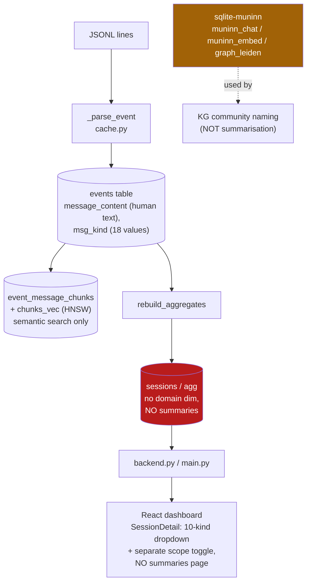
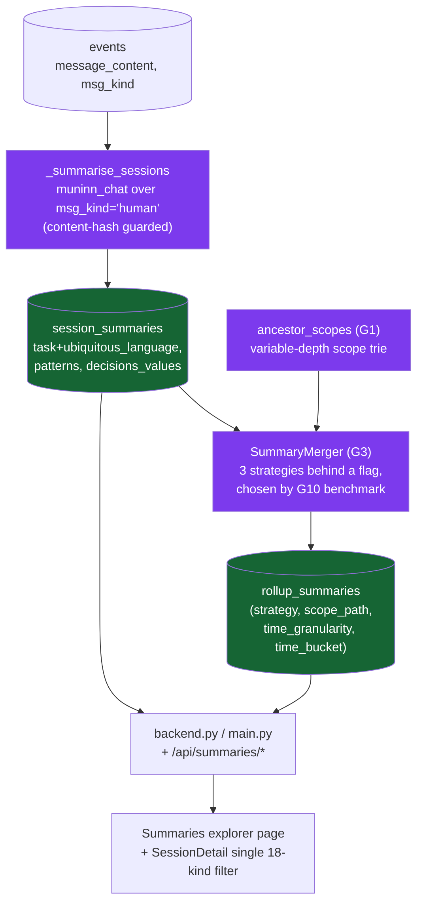

# Summariser — Discovery (Current & Desired State)

> - **Index:** [summariser.md](./summariser.md)

Review/background context: the before/after architecture, not loaded during the implementation loop.

## Current State

The dashboard ingests `~/.claude/projects/**/*.jsonl` into a cached SQLite index (`~/.claude/cache/introspect_sessions.db`, `SCHEMA_VERSION="17"`).
A wave pipeline parses events (`cache.py:_parse_event`), a single writer inserts rows, and `rebuild_aggregates` builds the `projects` / `sessions` / `agg` rollups.
The React app reads typed endpoints via `lib/api-client.ts`.

**Key facts established by the research:**

- **Human message text is already persisted and human-scoped.**
  `events.message_content` (`schema.py:107`) holds the extracted text of each event;
  a paragraph-split copy lives in `event_message_chunks` and is embedded for semantic search, scoped to `msg_kind='human'` (`embeddings.py:82`).
  The atomic unit a summariser needs — the developer's typed prompts per session — is already isolated and queryable.
- **The summarisation engine already ships and is wired up.**
  `sqlite-muninn` (`pyproject.toml`, authored in-house) exposes `muninn_chat(model_name, prompt)` — local GGUF LLM inference inside SQL —
  registered via `temp.muninn_chat_models` (`kg/runtime.py:register_chat_model`) and already called for KG community naming (`kg/community_naming.py:114`).
  It also provides `muninn_embed` (HNSW vectors) and `graph_leiden` (community detection, `kg/communities.py:58`).
  There is **no external-LLM infrastructure anywhere** (zero `anthropic`/`openai` imports) — the project is deliberately 100% local.
- **No summaries exist.** There is no `session_summaries` or `rollup_summaries` table, no summarisation pass in ingestion, and no summary endpoint or page.
- **`msg_kind` already enumerates exactly 18 canonical values** — 9 base kinds (`human`, `task_notification`, `tool_result`, `user_text`, `meta`, `assistant_text`, `thinking`, `tool_use`, `other`; `pricing.py:_base_message_kind`) × {main, `subagent-` prefixed} (`pricing.py:message_kind`, applied in `cache.py:563`).
  The frontend types them (`api-client.ts:549-565` `MessageKind`) but **SessionDetail exposes only a 10-option base dropdown** (`message-kinds.ts:18-29`) **plus a separate `Scope` toggle** (`matchesKindFilter`, tokenometrics T7.2) — the 18 are not selectable as one list.
- **`domain` is first-segment-only — no variable-depth aggregation.**
  `extract_domain(project_id)` (`config.py:39-58`) returns the first path segment under `$HOME` (`play`, `work`, `foss`, `clients`) and only powers `BLOCKED_DOMAINS` filtering + `/api/domains`.
  But the real need is a **variable-depth** hierarchy: `play`/`work`/`foss` reach projects in one level, while `clients/<client_name>` groups many projects two levels down — and aggregation is wanted at *every* prefix (per client, across all clients, per domain, all). The authoritative per-project path comes from `ProjectResolver`/`ProjectInfo.project_path` (`project_resolver.py:37-224`); dash-splitting the encoded id is unsafe because segment names contain dashes. No `sessions`/`agg` rollup is keyed by any scope path today.
- **The introspect script mirrors the schema by manual review.**
  `.claude/skills/introspect/scripts/introspect_sessions.py` hardcodes `SCHEMA_VERSION="17"` and its own pricing/parse copies; both ingesters write the same DB and must stay in parity (tokenometrics G8 precedent).

## Desired State

A summarisation pass runs `muninn_chat` over each session's human prompts, persists a structured extraction, then merges those bottom-up into a hierarchical knowledge base spanning scope (session → project → domain → all) and time (day / week / month).
The frontend gains a Summaries explorer, and SessionDetail's message filter becomes a single 18-way selector.

- **Per-session extraction.** A new `session_summaries` table stores, per session, a structured record extracting the three target lenses — **task + ubiquitous language**, **architectural patterns**, **decisions / values** — produced by `muninn_chat` over `msg_kind='human'` content. Keyed/guarded by a content hash so an unchanged session is never re-summarised on rebuild.
- **Hierarchical roll-ups.** A new `rollup_summaries` table holds summary-of-summaries at each `(scope_path, time_granularity, time_bucket)`, merged bottom-up over the **variable-depth scope trie** (session → project → …ancestor scopes… → root). The benchmark ([G10](./summariser.md)) decides whether merges re-ground in source excerpts to avoid the hallucination amplification that naive recursive merging causes (Ou & Lapata, ACL 2025; architecture per GraphRAG, Edge et al. 2024).
- **Variable-depth hierarchy as a first-class dimension** — every prefix of a project's home-relative path (`clients`, `clients/acme`, `clients/acme/app`, `play`, root) is an aggregation scope, so per-client, across-clients, per-domain, and all-domains roll-ups are all well-defined.
- **API + UI.** Typed endpoints expose summaries at any granularity; a new **Summaries** page lets a user pick scope + time grain and drill down. SessionDetail collapses the 10-option dropdown + scope toggle into a single 18-value (+ "All") `?msg=` selector.
- **Parity.** Every schema + summarisation change is mirrored in `introspect_sessions.py`.

