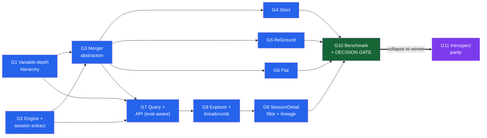
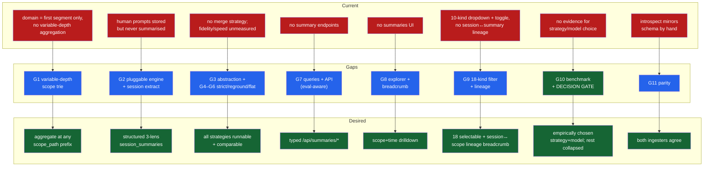
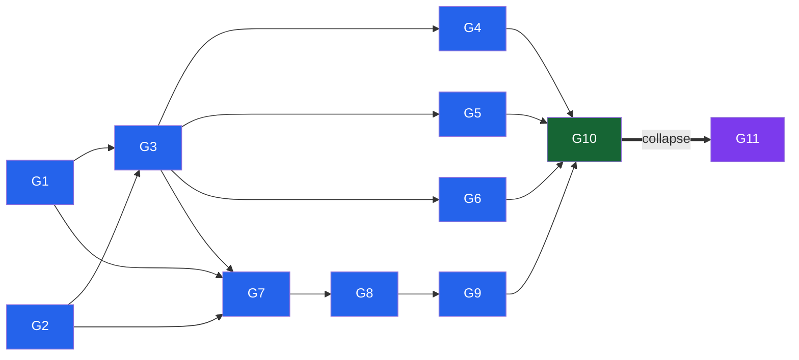

# Summariser: Hierarchical Human-Prompt Knowledge Extraction

<!-- VERIFICATION: sqlite-muninn capabilities (muninn_chat / muninn_embed / graph_leiden) are corroborated by in-repo ground truth (pyproject.toml dependency, uv.lock wheels, live call sites kg/community_naming.py:114, kg/communities.py:58) and the MIT GitHub repo (neozenith). External SOTA links verified: GraphRAG arXiv:2404.16130, Context-Aware Hierarchical Merging arXiv:2502.00977, Anthropic + Ollama structured-output docs. Two future-dated arXiv IDs surfaced in research (2602.04445, 2604.03826) were DROPPED as unverifiable, not cited. No LINK_NOT_VERIFIED markers remain. -->

---

<details>
<summary><b>Table of Contents</b></summary>
<!--TOC-->

- [Summariser: Hierarchical Human-Prompt Knowledge Extraction](#summariser-hierarchical-human-prompt-knowledge-extraction)
  - [Execution Plan](#execution-plan)
    - [Loop Runner Prompt](#loop-runner-prompt)
    - [Progress](#progress)
    - [Done Criteria](#done-criteria)
  - [Overview](#overview)
  - [Gap Analysis](#gap-analysis)
    - [Gap Map](#gap-map)
    - [Dependencies](#dependencies)
    - [Gaps (detailed specs)](#gaps-detailed-specs)
  - [Change Requests](#change-requests)
  - [Decisions (ADRs)](#decisions-adrs)
  - [Success Measures](#success-measures)
    - [Project Quality Bar (CI Gates)](#project-quality-bar-ci-gates)
    - [Domain-Specific Measures](#domain-specific-measures)
  - [Negative Measures](#negative-measures)
    - [Quality Bar Violations](#quality-bar-violations)
    - [Domain-Specific Failures](#domain-specific-failures)

<!--TOC-->
</details>

---

## Execution Plan

<details>
<summary><b>Loop runner, progress, done criteria</b> — execution detail for the <code>/loop</code> agent (collapsed for skim reading)</summary>

### Loop Runner Prompt

```
/loop Read the gap analysis spec index at docs/plans/summariser.md.

1. Read `/Users/joshpeak/play/claude-code-sessions/.claude/skills/plan-gap/resources/tdd/tdd.md` and apply its red-green-refactor workflow.
2. In the index Progress table, find the lowest-numbered "Next eligible" ticket whose `Depends on`
   are all `[x]`. Open that ticket file. If none is eligible, write "spec complete" and exit the loop.
3. RED — write the test named in the ticket's `Test` row. Run the suite. Confirm the new test fails.
4. GREEN — write the minimum code named in the ticket's `Implements` row. Run the suite. Confirm the
   new test passes and nothing regressed.
5. REFACTOR (optional) — apply the ticket's `Refactor` row while staying green; re-run after each step.
6. Mark the ticket file's `- [ ] **Done**` checkbox `[x]`.
7. Update the Progress table in the index (`[x]` done count, Next eligible, Blocked on).
8. Commit with message `T<n>.<m>: <ticket title>`.
9. Return — the loop fires again for the next eligible ticket.

If you hit an ambiguity the spec does not resolve, STOP the loop: add an `<!-- UNRESOLVED -->` ADR
placeholder under the relevant gap file, write a short status note on what blocked progress, and exit.
The user must re-enter Phase 2 refinement to resolve the ADR before the loop can resume.
```

> **Note for the runner — two enforced stops.** (1) **T10.7 is a non-code decision gate**: the production merge strategy [ADR3.2](./summariser-G3.md) is `<!-- UNRESOLVED -->` by design. When the loop reaches T10.7, STOP — the human reviews the G10 benchmark report through the G7/G8/G9 UI and records a PROCEED/ABANDON verdict; do not auto-decide. (2) **T10.8 + all of G11 are conditional on PROCEED**: on ABANDON, mark T10.8 and T11.1–T11.4 dropped (freeze the three strategies as a PoC, default the flag to the best-scoring option) and open a new gap-analysis. Schema-changing gaps bump `SCHEMA_VERSION`: **G2 → "18"**, **G3 → "19"** (each bump auto-DROP+recreates the cache via `ensure_cache`); G11 parity asserts both ingesters share the final value. Backend tests build a tiny fixture cache + an injected fake `SummaryEngine` — never the real 2 GB DB or live `muninn_chat`.

### Progress

| Gap | Tickets total | `[x]` done | `[ ]` todo | Next eligible | Blocked on |
|-----|---------------|-----------|-----------|---------------|------------|
| [G1](./summariser-G1.md) | 4 | 4 | 0 | — | — |
| [G2](./summariser-G2.md) | 7 | 7 | 0 | — | — |
| [G3](./summariser-G3.md) | 7 | 7 | 0 | — | — |
| [G4](./summariser-G4.md) | 3 | 3 | 0 | — | — |
| [G5](./summariser-G5.md) | 3 | 3 | 0 | — | — |
| [G6](./summariser-G6.md) | 3 | 3 | 0 | — | — |
| [G7](./summariser-G7.md) | 7 | 7 | 0 | — | — |
| [G8](./summariser-G8.md) | 6 | 6 | 0 | — | — |
| [G9](./summariser-G9.md) | 6 | 6 | 0 | — | — |
| [G10](./summariser-G10.md) | 8 | 6 | 2 | [T10.7](./summariser-G10-T10.7.md) _(enforced human gate)_ | [ADR3.2](./summariser-G3.md) _(human PROCEED/ABANDON verdict)_ |
| [G11](./summariser-G11.md) | 4 | 0 | 4 | — | [T10.8](./summariser-G10-T10.8.md) _(conditional on PROCEED)_ |

"Next eligible" = lowest-numbered `[ ]` ticket whose `Depends on` are all `[x]`. The dependency-free leaves are **[T1.1](./summariser-G1-T1.1.md), [T2.1](./summariser-G2-T2.1.md), [T9.1](./summariser-G9-T9.1.md), [T10.1](./summariser-G10-T10.1.md)** — any is a valid start; **T1.1** is recommended first (the most gaps transitively depend on the hierarchy). Total: **58 tickets** (G1–G11: 4+7+7+3+3+3+7+6+6+8+4).

### Done Criteria

- [ ] Every ticket file is marked `[x]` (or dropped per the ABANDON branch: T10.8 + G11)
- [ ] Every Success Measure (Project Quality Bar + Domain-Specific) passes when executed
- [ ] No `<!-- UNRESOLVED -->` ADR markers remain — note [ADR3.2](./summariser-G3.md) is resolved by the T10.7 human verdict, not in planning
- [ ] No `<!-- LINK_NOT_VERIFIED -->`, `<!-- ASSUMPTION -->`, or `<!-- PAYWALLED -->` markers requiring user resolution

</details>

## Overview

This initiative turns the dashboard's already-persisted human prompts into a tiered, self-learning knowledge base for becoming a better solution architect.
A summarisation pass runs the in-house `sqlite-muninn` local chat model (`muninn_chat`) over each session's `msg_kind='human'` content, extracting three lenses — **what task is being achieved (with the ubiquitous language of specific systems)**, **which architectural patterns are used or reused**, and **which decisions and values are expressed**.
Per-session extractions are then merged bottom-up into a variable-depth hierarchy across **scope** (session → project → …subdomains… → domain → all) and **time** (day → week → month), with the best merge strategy + model chosen empirically by a benchmark before the rest is built, and surfaced through a new explorer page.

**Gaps identified:**

- **[G1: Variable-depth project hierarchy resolution](./summariser-G1.md)** — resolve each project's full ancestor scope chain so summaries aggregate at every level (project → client → all clients → domain → all), variable depth per branch.
- **[G2: Summarisation engine abstraction + session extraction](./summariser-G2.md)** — model-pluggable `muninn_chat` engine over `msg_kind='human'` → structured `session_summaries`, content-hash guarded.
- **[G3: SummaryMerger abstraction + roll-up driver](./summariser-G3.md)** — the `SummaryMerger` interface, registry, `rollup_summaries` schema, and bottom-up driver, with freshness scoped by `(model_id, strategy_id)`.
- **[G4: SummaryMergerStrict](./summariser-G4.md)** — bottom-up, summaries-only merger; correctness TDD for faithful child synthesis.
- **[G5: SummaryMergerReGround](./summariser-G5.md)** — bottom-up + bounded source excerpts (Ou & Lapata) to keep higher tiers faithful.
- **[G6: SummaryMergerFlat](./summariser-G6.md)** — re-summarise raw descendant session summaries per scope, no intermediate tier.
- **[G7: Summaries query layer & API](./summariser-G7.md)** — typed endpoints addressed by `scope_path`, strategy/model-aware so benchmark permutations are comparable in the UI (collapse to one after the gate).
- **[G8: Summaries explorer page](./summariser-G8.md)** — a new React page to browse the scope trie with an up/down lineage breadcrumb + grain/strategy selectors.
- **[G9: SessionDetail evaluation — 18-kind filter + summary lineage](./summariser-G9.md)** — one flat 18-value (+ All) `?msg=` selector and the lineage breadcrumb linking a session to its scope summaries.
- **[G10: Empirical benchmark & decision gate](./summariser-G10.md)** — sweep {strategy × family {Gemma,Qwen,Kimi} × size {~2B,~4B,~9B}}, ROUGE-L/BLEU/F1 screen, human taste review *through the G7/G8/G9 UI*, then PROCEED-and-collapse or ABANDON-as-PoC.
- **[G11: Introspect-script parity](./summariser-G11.md)** — mirror the collapsed pipeline into the standalone introspect script (conditional on PROCEED).

> **Plan dynamics — conditional and collapsing.** G1–G9 are the committed, derisk-first spine: the variable-depth hierarchy, the model-pluggable engine, the merger abstraction (G3) with *all three* implementations behind a flag (G4 strict, G5 reground, G6 flat), and the **viewers (query/API, explorer, SessionDetail lineage) needed to evaluate them**. **G10 is the two-tier decision gate** — ROUGE-L/BLEU/F1 screen the {strategy × family × size} sweep, then the user makes the binding call *by reading the survivors in the real UI*. **PROCEED:** the winner clears the taste threshold → collapse (drop losing mergers + flag, remove the eval strategy/model selectors) → G11 mirrors the winner. **ABANDON:** nothing clears it → freeze all three as a proof-of-concept, default the flag to the best-scoring option, and open a *new* gap-analysis for the discovered failure modes. So **the collapse and G11 are conditional on PROCEED**; the G7/G8 viewers are built strategy/model-aware precisely so the gate can be judged. The unresolved selection ADR ([ADR3.2](./summariser-G3.md)) **stops the `/loop`** at the gate — the uncertainty is an enforced gate, not a hope.



> **Background — Current vs Desired State:** the before/after architecture (and the in-repo `muninn_chat` engine that makes local summarisation possible) lives in **[summariser-DISCOVERY.md](./summariser-DISCOVERY.md)** — review context, not needed once the implementation loop starts.

## Gap Analysis

### Gap Map



*Detail-density diagram (24 nodes — one current→gap→desired triple per gap; high preset). Gap-to-gap ordering is shown in the Dependencies diagram below.*

### Dependencies



**Recommended implementation order (derisk-first):** G1 + G2 in parallel (G2 bumps `SCHEMA_VERSION` and makes the engine model-pluggable) → G3 (merger abstraction + driver) → G4/G5/G6 (strict, reground, flat — parallel, each behind the flag) and the G7 → G8 → G9 UI branch in parallel → **G10 benchmark → DECISION GATE** (the loop stops; the human reads the survivors in the G7/G8/G9 UI, settles the strategy + model, and collapses the losers — or abandons) → G11 (parity, mirrors the *collapsed* pipeline; conditional on PROCEED).

---

### Gaps (detailed specs)

| Gap | Spec | Tickets | Summary |
|-----|------|:-------:|---------|
| G1 | [Variable-depth project hierarchy resolution](./summariser-G1.md) | TBD | Resolve each project's variable-depth ancestor scope chain (project → … → root) for aggregation at every level. |
| G2 | [Summarisation engine abstraction + session extraction](./summariser-G2.md) | TBD | Model-pluggable `muninn_chat` engine over `msg_kind='human'` → structured 3-lens `session_summaries`, content-hash guarded. |
| G3 | [SummaryMerger abstraction + roll-up driver](./summariser-G3.md) | TBD | The `SummaryMerger` interface, registry, `rollup_summaries` schema, and bottom-up driver; freshness scoped by `(model_id, strategy_id)`. |
| G4 | [SummaryMergerStrict](./summariser-G4.md) | TBD | Bottom-up, summaries-only merger; faithful child synthesis, no excerpts. |
| G5 | [SummaryMergerReGround](./summariser-G5.md) | TBD | Bottom-up + bounded deterministic source excerpts to keep higher tiers faithful. |
| G6 | [SummaryMergerFlat](./summariser-G6.md) | TBD | Re-summarise raw descendant session summaries per scope, no intermediate tier. |
| G7 | [Summaries query layer & API](./summariser-G7.md) | TBD | Typed `scope_path`-addressed endpoints; strategy/model-aware for evaluation, collapse to one after the gate. |
| G8 | [Summaries explorer page](./summariser-G8.md) | TBD | New React page browsing the scope trie with an up/down lineage breadcrumb + grain/strategy selectors. |
| G9 | [SessionDetail evaluation — 18-kind filter + summary lineage](./summariser-G9.md) | TBD | One 18-value (+ All) `?msg=` selector plus the lineage breadcrumb linking a session to its scope summaries. |
| G10 | [Empirical benchmark & decision gate](./summariser-G10.md) | TBD | Sweep {strategy × family × size}; ROUGE-L/BLEU/F1 screen + human taste gate via the UI; PROCEED-and-collapse or ABANDON-as-PoC. |
| G11 | [Introspect-script parity](./summariser-G11.md) | TBD | Mirror the collapsed single-strategy pipeline into the introspect script (conditional on PROCEED). |

## Change Requests

Midflight scope discovered during implementation. A CR is raised when a ticket as written
cannot be satisfied with real, executable code (distinct from an `<!-- UNRESOLVED -->` ADR,
which is a pending *decision*). Each CR names the gap/ticket where it was discovered.

| CR | Title | Discovered in | Status |
|----|-------|---------------|--------|
| [CR1](./summariser-CR1.md) | Make the G10 benchmark real, runnable, and self-contained in `summarise_cli` | [G10](./summariser-G10.md) / [T10.7](./summariser-G10-T10.7.md) | in progress |

## Decisions (ADRs)

<!-- TODO: roll-up table (ADR, Decision, Why), one row per settled ADR, populated in Phase 2. Unresolved questions are seeded as <!-- UNRESOLVED --> placeholders in the gap files. -->

| ADR | Decision | Why |
|-----|----------|-----|
| [ADR1.1](./summariser-G1.md) | Domains are a variable-depth path hierarchy; aggregate at every `scope_path` prefix (from the resolved path, not dash-split) | Per-client AND across-clients AND per-domain AND all need every prefix; a fixed trichotomy can't express it |
| [ADR2.1](./summariser-G2.md) | Summarise with the local `muninn_chat` engine (no external API); model deferred to G10 | Zero new deps/keys/cost; reproducible; preserves the 100%-local, fail-loud invariant |
| [ADR2.2](./summariser-G2.md) | Summarise `msg_kind='human'` only | Cleanest intent signal; same scope already embedded |
| [ADR2.3](./summariser-G2.md) | Content-hash guard; cache-resident summaries; recompute only changed sessions (once per schema bump) | Consistent with rebuildable-from-source; cheap incremental updates; local inference makes recompute free |
| [ADR2.4](./summariser-G2.md) | Summarisation is decoupled from ingest — manual CLI runners per `(strategy, model, level)`, eventually consistent | Lets each tier bind to its own external cadence; one call surface shared with the G10 benchmark |
| [ADR3.1](./summariser-G3.md) | Defer merge-strategy selection to the G10 empirical benchmark; build all three behind a flag, collapse after | The fidelity/speed trade-off is corpus- and model-dependent; measure on this data before committing production |
| [ADR3.3](./summariser-G3.md) | Rollups + freshness are keyed/scoped by `(strategy, model_id)`; a child merges only into a same-model parent | The benchmark rolls up every `(strategy, model)` at once; without it they clobber or false-skip |
| [ADR3.4](./summariser-G3.md) | Roll-ups run per level band (leaf…root) on an external cadence, off `session_summaries` to date | Match cadence to volatility (leaf daily, domain/root weekly); eventual consistency, no ingest coupling |
| [ADR5.1](./summariser-G5.md) | Re-grounding uses a bounded, deterministic top-K excerpt sample (recency then length) | Determinism keeps the benchmark reproducible; the cap bounds prompt size at high tiers |
| [ADR7.1](./summariser-G7.md) | Un-summarised scope → `200 {status:"not_summarised"}`; unknown scope → `404`; never fabricate | Explicit typed payloads + fail-loud; distinguishes "not yet computed" from "missing" |
| [ADR7.2](./summariser-G7.md) | Query/API + explorer are strategy/model-parameterised for evaluation; selectors removed on collapse | The human gate must compare benchmark permutations in the real UI before one is chosen |
| [ADR8.1](./summariser-G8.md) | Page-local `?path=`/`?grain=`/`?bucket=`; reuse global `?project=`/`?days=` | The documented URL-as-state global-vs-page-local split |
| [ADR9.1](./summariser-G9.md) | Single flat 19-option dropdown; remove the scope toggle (supersedes tokenometrics T7.2) | Literally the brief — every kind directly selectable from one control |
| [ADR9.2](./summariser-G9.md) | Reuse one `ScopeBreadcrumb` for up/down session↔scope lineage on SessionDetail + explorer | The user evaluates from SessionDetail too; shared navigation shows how a session relates to each roll-up tier |
| [ADR10.1](./summariser-G10.md) | Two-tier evaluation: ROUGE-L/BLEU/F1 against a curated gold set as a screen, then a binding human taste review in the UI | Reference metrics are a cheap reproducible "is it working?" filter; extraction quality is subjective, so the human gate decides |
| [ADR10.2](./summariser-G10.md) | Sweep families {Gemma, Qwen, Kimi} × sizes {~2B, ~4B, ~9B} × the 3 strategies; log no-GGUF cells | Isolates the family and size axes the user wants to tune; size buckets bound runtime |
| [ADR10.3](./summariser-G10.md) | Gate has two outcomes — PROCEED (collapse → G11) or ABANDON (freeze as PoC, best-scoring default, new plan) | If the best achievable quality isn't worth the user's attention, building further on it is the wasted effort this structure avoids |

## Success Measures

### Project Quality Bar (CI Gates)

| Gate | Command | Threshold | Applies to |
|------|---------|-----------|------------|
| Types (Py) | `make typecheck` (mypy strict) | 0 errors | all `src/` + `tests/` changes |
| Types (TS) | `tsc` (via `make typecheck`) | 0 errors | all `frontend/src/` changes |
| Lint | `make lint` (ruff + eslint) | 0 errors | all changes |
| Format | `make format` (ruff) | clean | edited Python only (never `tests/`) |
| Backend tests | `make test-backend` (pytest) | pass | G1–G7, G10, G11 |
| Frontend unit | `make test-frontend` (vitest) | pass | G8, G9 |
| E2E | `make test-frontend-e2e` (playwright) | pass | G8, G9 |
| Full gate | `make ci` | green | the whole initiative |

### Domain-Specific Measures

- **[G1](./summariser-G1.md):** `ancestor_scopes` for a `clients/acme/app` project yields `['', 'clients', 'clients/acme', 'clients/acme/app']` and for a `play/foo` project `['', 'play', 'play/foo']`; segment names containing dashes resolve via the authoritative `project_path`, not by dash-splitting the encoded id.
- **[G2](./summariser-G2.md):** every session with ≥1 `msg_kind='human'` event has exactly one `session_summaries` row **per summariser model** with all three lenses non-empty; re-running on unchanged text for the same model performs zero `muninn_chat` calls (content-hash hit) while a new model writes a new row; the engine is invoked through a model-name-parameterised interface; a `summarise sessions` CLI run (decoupled from ingest, no fresh ingest required) summarises only the not-yet-current sessions in the chosen scope.
- **[G3](./summariser-G3.md):** `roll_up_scopes` writes one `rollup_summaries` row per `(strategy, model, scope_path, grain, bucket)` via `get_merger(flag)`; a `(strategy, model)` rollup merges only that model's children; `source_hash` freshness scoped by `(model, strategy)` skips unchanged and recomputes on any change; an unknown flag raises (no silent default); the root scope `''` yields the all-domains rollup; `roll_up_scopes` runs a single `level` band per invocation so tiers can be triggered on independent cadences off the `session_summaries` that exist to date; a band whose child tier is behind or partially summarised merges what exists and is **not** an error (silent eventual consistency — the gap closes on the next cadence run).
- **[G4](./summariser-G4.md):** `SummaryMergerStrict` synthesises children with no source excerpts (identical engine prompt with or without excerpts passed) and the `strict` flag writes `strategy='strict'` rows.
- **[G5](./summariser-G5.md):** `SummaryMergerReGround` includes a bounded, deterministic top-K source-excerpt sample in its merge prompt — observably distinct from `strict` for the same children.
- **[G6](./summariser-G6.md):** `SummaryMergerFlat` builds each scope from raw descendant `session_summaries` (an ancestor's `child_count` equals descendant sessions, not child scopes); the driver honors `child_mode='raw_sessions'`.
- **[G7](./summariser-G7.md):** `/api/summaries/scope?path=` returns typed payloads honoring `days`/`project` and the optional `strategy`/`model` selectors; an un-summarised scope returns `{status:"not_summarised"}`, never a fabricated summary; `/api/summaries/variants` lists the strategy/model pairs present.
- **[G8](./summariser-G8.md):** the explorer renders the three lenses for a chosen `scope_path` + grain, the breadcrumb drills both up and down the trie, and scope/grain/strategy deep-link via URL params.
- **[G9](./summariser-G9.md):** the SessionDetail filter offers 19 options (All + 18 kinds) and `subagent-thinking` round-trips through `?msg=`; the lineage breadcrumb links the session to each ancestor scope summary in the explorer.
- **[G10](./summariser-G10.md):** the sweep is reproducible (fixed seed/temp) and resumable (manifest status), and emits, per {strategy × family × size}, a speed figure and ROUGE-L/BLEU/F1 scored against the curated gold set; the report ranks permutations, surfaces the top candidates for the human taste gate (reviewed via the G8/G9 UI), and records a PROCEED or ABANDON outcome with its evidence.
- **[G11](./summariser-G11.md):** backend and introspect script produce identical `session_summaries` + `rollup_summaries` rows (for the winning strategy) for a shared fixture and report the same `SCHEMA_VERSION`.

## Negative Measures

### Quality Bar Violations

- **Graceful degradation** (forbidden by global rules + MEMORY.md): wrapping `muninn_chat` or JSON-parse of its output in try/except that silently substitutes an empty/placeholder summary instead of failing loud. A model/parse failure must surface, not produce a plausible-looking blank summary.
- **`python -c` / ad-hoc invocations** (forbidden): verification uses `sqlite3` CLI or proper script files, never `uv run python -c`.
- **Schema migration via ALTER** (per MEMORY.md): the new summary tables arrive via `SCHEMA_VERSION` bump + DROP/recreate, not `ALTER TABLE`.
- **Drifting the two ingestion copies** (G11): editing `cache.py`/`schema.py` summarisation without mirroring `introspect_sessions.py` reintroduces divergence.

### Domain-Specific Failures

- **Choosing by vibes, not evidence:** settling the production merge strategy/model before the G10 benchmark report exists (or against it) — the decision gate is bypassed and the spike's whole purpose is lost.
- **Unreproducible benchmark:** the sweep can't be re-run to the same numbers (no fixed seed/temp, non-resumable), so the "winner" isn't defensible and silently truncated permutations read as full coverage.
- **Metric-as-arbiter:** treating ROUGE-L/BLEU/F1 as the pass/fail verdict instead of a screen, letting a high n-gram-overlap score override the binding human taste gate — or scoring against a missing/degenerate gold reference set so the numbers are meaningless.
- **Premature collapse:** deleting the losing mergers/flag before the gate, or **failing to collapse** after it (leaving dead strategies + flags in production) — both leave the codebase lying about what's live.
- **Hallucination amplification:** rolling up summaries-of-summaries without re-grounding in source excerpts, so higher tiers invent patterns/decisions absent from the sessions (the exact failure Ou & Lapata flag) — and a faithfulness metric too weak to catch it.
- **Silent staleness:** new sessions land but their summaries are never (re)computed, so a "domain summary" looks current while omitting recent work.
- **Scope leakage:** subagent or assistant text bleeding into a "human-only" summary, mischaracterising what the human actually asked for.
- **Non-reproducible churn:** every `SCHEMA_VERSION` bump silently re-runs thousands of `muninn_chat` calls (time blowup) because summaries aren't content-hash guarded.
- **Domain mis-bucketing:** deriving `scope_path` by dash-splitting the encoded `project_id` instead of the resolved `project_path`, so a dashed segment name splits into phantom scope levels — or a nested client path collapsing so two clients' work merges into one summary.
