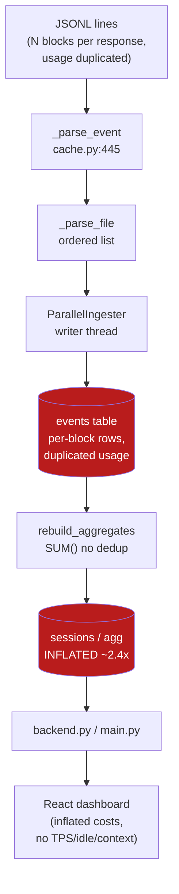
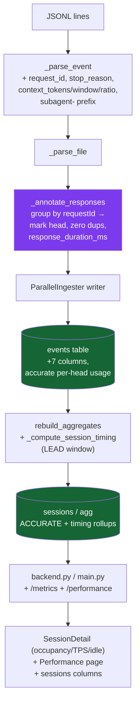

# Tokenometrics — Discovery (Current & Desired State)

> - **Index:** [tokenometrics.md](./tokenometrics.md)

Review/background context: the before/after architecture, not loaded during the implementation loop.

## Current State

The dashboard ingests `~/.claude/projects/**/*.jsonl` into a cached SQLite index. Ingestion is a wave pipeline (`database/sqlite/wave_pipeline.py`) driving a `ParallelIngester` (`parallel_ingester.py`): worker threads parse files (`CacheManager._parse_file` → `_parse_event`, `cache.py:254`/`:445`) and a single writer thread inserts rows (`_write_parsed`, `cache.py:298`). Costs/classification live in `database/sqlite/pricing.py`. Rollups (`rebuild_aggregates`, `cache.py:695`) and the `agg` star-schema feed the API (`database/sqlite/backend.py`, contract in `database/protocol.py`, routes in `main.py`). The React app (`frontend/src/`) reads typed endpoints via `lib/api-client.ts`.

**Key facts established by investigating the real data:**

- A single model response (one `requestId`) is logged as **N content-block events** (1 thinking + 1 text + many tool_use). **Every block repeats the same** `output_tokens` / `input_tokens` / `cache_read_input_tokens` / `cache_creation_input_tokens`. Verified on the largest session file: naive per-event `SUM(output_tokens)` = **8,439,850** vs requestId-deduped = **3,462,111** (≈2.44× inflation). `rebuild_aggregates` (`cache.py:719-720`) and the `agg` table sum per event with no dedup, so **all dashboard token + cost totals are inflated**.
- For an assistant event, `input_tokens + cache_read_tokens + cache_creation_tokens` **is** the live context-window occupancy (the full prompt sent), constant across a requestId's blocks. No occupancy field, ratio, or per-model window exists anywhere today.
- Observed max occupancy per model: `opus-4-7` 999,948 and `opus-4-6` 970,536 (1M windows), while `sonnet-4-5/4-6`, `opus-4-5`, `haiku-4-5` all stay under ~200k — empirical corroboration that the window is a per-model constant.
- `msg_kind` is derived by `message_kind(event_type, is_meta, content)` (`pricing.py:64`) into 9 kinds with no subagent awareness. **1,335 events** living in subagent / `agent_root` files are currently classed `human` (plus 16 `user_text`) — the mislabel bug. All such events carry `is_sidechain=1`.
- There is **no per-assistant `durationMs`** in the JSONL (only on hook/system events), so response duration must be derived from event timestamps.

## Desired State

A response-aware ingestion pass corrects the counts and annotates each event, new query methods expose the metrics, and the frontend surfaces them.

- Ingestion gains a per-file post-pass `_annotate_responses` that groups assistant events by `requestId`, marks one **head** per response, **zeroes the duplicated usage on non-heads** (so every existing `SUM()` is correct with no query rewrites), and stamps `response_duration_ms` on the head.
- Each event carries `context_tokens`, `context_window` (from a curated map), and `context_ratio`. Subagent events carry `subagent-<kind>` msg_kinds.
- New `sessions` rollups (`avg_tps`, `total_idle_ms`, `total_active_ms`, `peak_context_ratio`, …) and two new endpoints: per-session turn metrics and a cross-session performance summary.
- Frontend: per-event context-occupancy bar + TPS + idle markers in SessionDetail, a new **Performance** page (TPS by model, context-utilization ratio histogram, idle/active split), sessions-list columns, and a subagent dimension on the message-kind filter.

