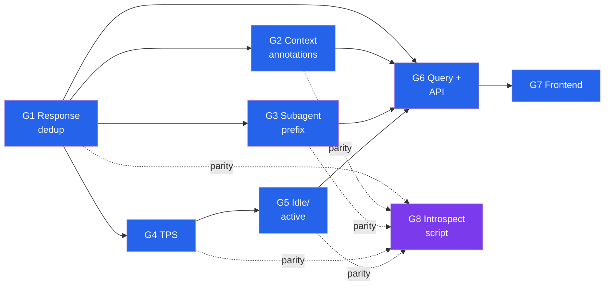
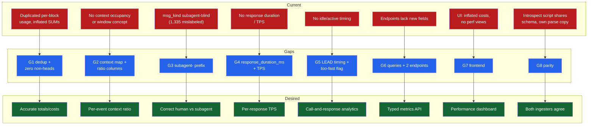
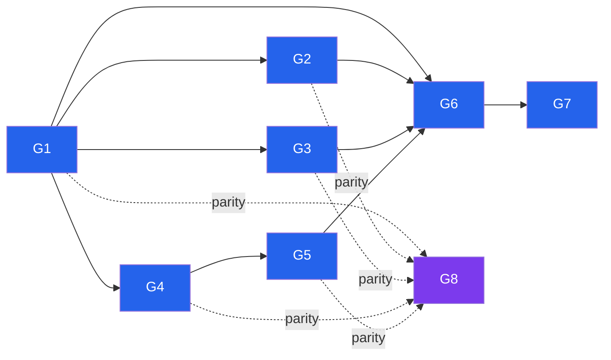

# Tokenometrics: Performance, Idle Time & Context-Window Analytics

<!-- VERIFICATION: Claude 4.6/4.7/4.8 + Sonnet 4.6 window figures postdate the model knowledge cutoff and are sourced from live vendor docs; independently corroborated by observed occupancy (opus-4-7 reached ~1M, sonnet/opus-4-5/haiku stayed <200k — see Current State). No LINK_NOT_VERIFIED markers remain. NOTE: zone-labeling (smart/caution/danger) was dropped per the G2 ADR "Quantitative ratio only"; context utilization is exposed as the raw context_ratio. -->

---

<details>
<summary><b>Table of Contents</b></summary>
<!--TOC-->

- [Tokenometrics: Performance, Idle Time & Context-Window Analytics](#tokenometrics-performance-idle-time--context-window-analytics)
  - [Execution Plan](#execution-plan)
    - [Loop Runner Prompt](#loop-runner-prompt)
    - [Progress](#progress)
    - [Done Criteria](#done-criteria)
  - [Overview](#overview)
  - [Gap Analysis](#gap-analysis)
    - [Gap Map](#gap-map)
    - [Dependencies](#dependencies)
    - [Gaps (detailed specs)](#gaps-detailed-specs)
  - [Decisions (ADRs)](#decisions-adrs)
  - [Success Measures](#success-measures)
    - [Project Quality Bar (CI Gates)](#project-quality-bar-ci-gates)
    - [Domain-Specific Measures](#domain-specific-measures)
  - [Negative Measures](#negative-measures)
    - [Quality Bar Violations](#quality-bar-violations)
    - [Domain-Specific Failures](#domain-specific-failures)

<!--TOC-->
</details>

---

## Execution Plan

<details>
<summary><b>Loop runner, progress, done criteria</b> — execution detail for the <code>/loop</code> agent (collapsed for skim reading)</summary>

### Loop Runner Prompt

```
/loop Read the gap analysis spec at docs/plans/tokenometrics.md.

1. Read `.claude/skills/plan-gap/resources/tdd/tdd.md` and apply its red-green-refactor workflow.
2. Find the next ticket whose status is `[ ]` and whose `Depends on` are all `[x]`.
   If none exists, write "spec complete" and exit the loop.
3. RED — write the test described in the ticket's `Test outline`. Run the test
   suite. Confirm the new test fails.
4. GREEN — write the minimum code described in `Implementation outline`. Run the
   test suite. Confirm the new test passes and no existing tests regressed.
5. REFACTOR (optional) — apply the ticket's `Refactor candidates` while staying
   green. Re-run the test suite after each refactor step.
6. Mark the ticket's status checkbox `[x]` in docs/plans/tokenometrics.md.
7. Update the Progress table in the Execution Plan section.
8. Commit the changes with message `T<N>.<M>: <ticket title>`.
9. Return — the loop will fire again for the next eligible ticket.

If you encounter an ambiguity that the spec does not resolve, STOP the loop:
add an `<!-- UNRESOLVED -->` ADR placeholder under the relevant `G<N>`,
write a short status note explaining what blocked progress, and exit.
The user must re-enter Phase 2 refinement to resolve the ADR before the
loop can resume.
```

> **Note for the runner:** Each schema-changing gap bumps `SCHEMA_VERSION` (G1 → `"14"`, G2 → `"15"`, and G4/G5 bump further as they add columns) so `ensure_cache` auto-DROPs+recreates an existing cache — adding columns at the *same* version is unsafe, because `CREATE TABLE IF NOT EXISTS` can't add columns to a live cache and ingestion of new files then fails with "no such column". A reingest happens automatically on each bump. Backend ticket tests should build a tiny fixture cache rather than depend on the 2 GB production DB. The **final** `SCHEMA_VERSION` (after G5) is whatever the constant reads — G8 parity asserts both ingesters share that same value, not a hardcoded literal.

### Progress

| Gap | Tickets total | `[x]` done | `[ ]` todo | Next eligible | Blocked on |
|-----|---------------|-----------|-----------|---------------|------------|
| [G1](./tokenometrics-G1.md) | 4 | 4 | 0 | — _(done)_ | — |
| [G2](./tokenometrics-G2.md) | 6 | 6 | 0 | — _(done)_ | — |
| [G3](./tokenometrics-G3.md) | 3 | 3 | 0 | — _(done)_ | — |
| [G4](./tokenometrics-G4.md) | 2 | 2 | 0 | — _(done)_ | — |
| [G5](./tokenometrics-G5.md) | 4 | 4 | 0 | — _(done)_ | — |
| [G6](./tokenometrics-G6.md) | 3 | 3 | 0 | — _(done)_ | — |
| [G7](./tokenometrics-G7.md) | 4 | 4 | 0 | — _(done)_ | — |
| [G8](./tokenometrics-G8.md) | 1 | 1 | 0 | — _(done)_ | — |

**Dropped tickets** (counted as `[x]`, no work required): **T2.5** — the smart/caution/danger zone classifier and its absolute-token override were removed per the G2 ADR "Quantitative ratio only"; **T7.1** — the frontend zone classifier is likewise unnecessary. Context utilization is exposed as the raw `context_ratio` everywhere.

"Next eligible" = lowest-numbered `[ ]` ticket whose `Depends on` are all `[x]`. The leaf tracer bullets (no deps) are **[T1.1](./tokenometrics-G1-T1.1.md), [T2.1](./tokenometrics-G2-T2.1.md), [T3.1](./tokenometrics-G3-T3.1.md)** — any is a valid starting point; [T1.1](./tokenometrics-G1-T1.1.md) is recommended first since the most gaps transitively depend on it.

### Done Criteria

- [x] Every ticket in every `G<N>` is marked `[x]` (T2.5 + T7.1 dropped per the zone-labeling ADR)
- [~] Every Success Measure passes when executed — backend/frontend domain measures verified via the hermetic test suite (391 backend tests; vitest; two live Playwright e2e); the G1 domain measure's exact **8.44M→3.46M** figure is a property of the full production corpus and needs a one-time `~/.claude/cache` reingest at `SCHEMA_VERSION 17` to confirm against the real sample file. Full `make ci` not run end-to-end in-loop (frontend e2e verified per-spec against the loop's v17 cache).
- [x] No `<!-- UNRESOLVED -->` ADR markers remain
- [x] No `<!-- LINK_NOT_VERIFIED -->`, `<!-- ASSUMPTION -->`, or `<!-- PAYWALLED -->` markers requiring user resolution

</details>

## Overview

This initiative derives new analytics from Claude Code session JSONL logs, surfaced through the existing FastAPI + SQLite + React dashboard:

1. **Tokens/sec (TPS)** — model *performance*: a response's output tokens ÷ that response's own generation duration.
2. **Idle / active time** — the call-and-response delay between the assistant yielding the turn and the human's next prompt, plus the inverse "active/working" time, plus a flag for "responded implausibly fast to have read the output."
3. **Context-window utilization ratio (normalized)** — how full the model's context window is at each response, normalized per model (200k / 1M / 32k locals), exposed as a raw quantitative ratio (no categorical zone labeling).
4. **Accurate per-event accumulation** — annotate each event with its live context occupancy and the ratio of the model's window budget it represents.
5. **Subagent labeling** — prefix every `msg_kind` with `subagent-` when the event belongs to a subagent context.

Investigating the real cache (`~/.claude/cache/introspect_sessions.db`, 2 GB) surfaced a **prerequisite correctness bug**: the cache over-counts every token measure ~2.4× because each model response is logged as many content-block events that all repeat the same request-level usage, and the rollups `SUM()` them without deduping. Fixing this is the foundation the new metrics build on.

**Gaps identified:**

- **[G1: Response-level token accounting](./tokenometrics-G1.md)** — dedupe per `requestId`; zero duplicated usage so all existing totals/costs become accurate.
- **[G2: Context-window utilization annotations](./tokenometrics-G2.md)** — curated `model_id → window` map; per-event `context_tokens` / `context_window` / `context_ratio`.
- **[G3: Subagent message-kind prefixing](./tokenometrics-G3.md)** — `subagent-<kind>` when the event is in a subagent context.
- **[G4: Response performance (TPS)](./tokenometrics-G4.md)** — per-response `response_duration_ms` + derived tokens/sec on response heads.
- **[G5: Turn timing (idle / active)](./tokenometrics-G5.md)** — call-and-response decomposition + "too-fast reply" flag, session rollups.
- **[G6: Query layer & API endpoints](./tokenometrics-G6.md)** — expose new fields; `get_session_metrics` + `get_performance_summary`.
- **[G7: Frontend surfacing](./tokenometrics-G7.md)** — SessionDetail occupancy/TPS/idle, new Performance page, sessions-list columns, subagent filter.
- **[G8: Introspect-script parity](./tokenometrics-G8.md)** — mirror all ingestion changes in the standalone introspect script that shares the schema.



> **Background — Current vs Desired State:** the before/after architecture (and the ~2.4× over-count bug that motivates G1) lives in **[tokenometrics-DISCOVERY.md](./tokenometrics-DISCOVERY.md)** — review context, not needed once the implementation loop starts.

## Gap Analysis

### Gap Map



*Detail-density diagram (24 nodes — one current→gap→desired triple per gap; high preset). Gap-to-gap ordering is intentionally omitted here and shown in the Dependencies diagram below.*

### Dependencies



**Recommended implementation order:** G1 (foundation: schema bump + dedup + reingest) → G2, G3, G4 in parallel (all ride the same ingestion change) → G5 (needs G4's duration/heads) → G6 (queries over the new columns) → G7 (frontend) → G8 (introspect-script parity, mirrors G1–G5). Each schema-changing gap (G1, G2, G4, G5) bumps `SCHEMA_VERSION`, so `ensure_cache` auto-DROPs+recreates the corpus on the next run — no manual reingest needed, but the full rebuild does cost a pass over the 2 GB corpus each time.

---

### Gaps (detailed specs)

Each gap is split into its own spec file with full **Current / Gap / Output(s) / References / ADRs / Tickets**. Dependency ordering is shown in the [Dependencies](#dependencies) diagram above; each spec header also links to the gaps it depends on and blocks.

| Gap | Spec | Tickets | Summary |
|-----|------|:-------:|---------|
| G1 | [Response-level token accounting](./tokenometrics-G1.md) | 4 | Dedupe per `requestId`; zero duplicated usage so all existing totals/costs become accurate. |
| G2 | [Context-window utilization annotations](./tokenometrics-G2.md) | 6 | Curated `model_id → window` map; per-event occupancy + normalized context ratio (raw quantitative, no zone labels). |
| G3 | [Subagent message-kind prefixing](./tokenometrics-G3.md) | 3 | `subagent-<kind>` prefix whenever the event belongs to a subagent context. |
| G4 | [Response performance (TPS)](./tokenometrics-G4.md) | 2 | Per-response `response_duration_ms` + derived tokens/sec on response heads. |
| G5 | [Turn timing (idle / active)](./tokenometrics-G5.md) | 4 | Idle/active call-and-response decomposition + a too-fast-reply flag. |
| G6 | [Query layer & API endpoints](./tokenometrics-G6.md) | 3 | Expose the new fields; add `get_session_metrics` + `get_performance_summary` endpoints. |
| G7 | [Frontend surfacing](./tokenometrics-G7.md) | 4 | SessionDetail occupancy/TPS/idle, a Performance page, sessions-list columns, subagent filter. |
| G8 | [Introspect-script parity](./tokenometrics-G8.md) | 1 | Mirror every ingestion change in the standalone introspect script that shares the schema. |

## Decisions (ADRs)

The design decisions and their values, scoped to the gap that owns them. Full **Decision / Why / Rejected** in each gap spec.

| ADR | Decision | Why |
|-----|----------|-----|
| [ADR1.1](./tokenometrics-G1.md) | Fix the token over-count everywhere (zero non-head usage) | Accuracy over inflated historicals, with no query rewrites |
| [ADR1.2](./tokenometrics-G1.md) | Last block is the response head | It carries `stop_reason` + final usage; end-to-end timing |
| [ADR2.1](./tokenometrics-G2.md) | Accumulated count is live occupancy | Bounded by the window — the only meaningful ratio basis |
| [ADR2.2](./tokenometrics-G2.md) | Window from a curated per-model map | 1M is GA per model, so window is a pure function of `model_id` |
| [ADR2.3](./tokenometrics-G2.md) | Expose the raw ratio, no zone labels | "Smart zone" is subjective; % used is quantitative and sufficient |
| [ADR3.1](./tokenometrics-G3.md) | Detect subagents by sidechain or file type | `is_sidechain` is reliable; file-type union guards a missing flag |
| [ADR3.2](./tokenometrics-G3.md) | Subagent scope is a separate filter param | Keeps the kind dropdown readable and the URL legible |
| [ADR4.1](./tokenometrics-G4.md) | TPS is output ÷ response duration | Measures model performance, not wall-clock including idle |
| [ADR5.1](./tokenometrics-G5.md) | Too-fast flag at an 8 tok/s skim bar | Fires only when a reply was impossible to have read |
| [ADR6.1](./tokenometrics-G6.md) | Per-model summary plus raw-ratio histogram | Project drilldown comes free from the existing filters |

## Success Measures

### Project Quality Bar (CI Gates)

| Gate | Command | Threshold | Applies to |
|------|---------|-----------|------------|
| Types (Py) | `make typecheck` (mypy strict) | 0 errors | all `src/` + `tests/` changes |
| Types (TS) | `tsc` (via `make typecheck`) | 0 errors | all `frontend/src/` changes |
| Lint | `make lint` (ruff + eslint) | 0 errors | all changes |
| Format | `make format` (ruff) | clean | all Python |
| Backend tests | `make test-backend` (pytest) | pass | G1–G6, G8 |
| Frontend unit | `make test-frontend` (vitest) | pass | G7 |
| E2E | `make test-frontend-e2e` (playwright) | pass | G7 |
| Full gate | `make ci` | green | the whole initiative |

### Domain-Specific Measures

- **[G1](./tokenometrics-G1.md):** For the known sample file, post-reingest `SUM(output_tokens)` over a session equals the requestId-deduped value (≈8.44M → 3.46M); exactly one `is_response_head=1` per `requestId`.
- **[G2](./tokenometrics-G2.md):** `context_window('claude-opus-4-7')==1_000_000`, `('claude-sonnet-4-5-...')==200_000`, `('qwen2.5-coder-7b-instruct')==32_768`, `('<synthetic>')` is `None`; `context_ratio(tokens, window)` returns the raw fraction `tokens/window` ∈ (0,1] for known windows and `None` for an unknown window. No categorical zone labeling exists (dropped per the G2 ADR "Quantitative ratio only").
- **[G3](./tokenometrics-G3.md):** Zero events in subagent/`agent_root` files retain a bare `human`/`user_text` kind; all are `subagent-*`.
- **[G4](./tokenometrics-G4.md):** `tps` is `None` when `response_duration_ms` is 0/NULL, else `output_tokens/(ms/1000)`; never negative.
- **[G5](./tokenometrics-G5.md):** `total_active_ms + total_idle_ms` reconciles to the session wall-clock within tolerance; `too_fast` set only when idle < output/READ_TOKENS_PER_SEC.
- **[G6](./tokenometrics-G6.md):** `/api/performance` and `/api/sessions/{p}/{s}/metrics` return typed payloads honoring `days`/`project`.
- **[G7](./tokenometrics-G7.md):** SessionDetail shows occupancy bar + TPS + idle markers; Performance page renders all charts; subagent filter works via `?msg=`.
- **[G8](./tokenometrics-G8.md):** Backend and introspect script produce byte-identical event rows for a shared fixture and report the **same** `SCHEMA_VERSION` (the current constant, bumped per schema-changing gap — `"15"` after G2).

## Negative Measures

### Quality Bar Violations

- **Graceful degradation** (forbidden by global rules + MEMORY.md): wrapping the context-window lookup or duration parse in try/except that silently substitutes 0/None instead of failing loud on a genuinely unexpected shape. Missing window for a *known* model must be a test failure, not a shrug.
- **`python -c` / ad-hoc invocations** (forbidden): verification must use `sqlite3` CLI or proper script files, never `uv run python -c`.
- **Schema migration via ALTER** (per MEMORY.md): new columns must arrive via `SCHEMA_VERSION` bump + DROP/recreate, not `ALTER TABLE` (which `CREATE TABLE IF NOT EXISTS` would no-op).
- **Drifting the two pricing/parse copies** (G8): editing `pricing.py`/`cache.py` without mirroring `introspect_sessions.py` reintroduces divergence.

### Domain-Specific Failures

- **Silent re-inflation:** a later query that joins back to non-head rows, or a new `SUM()` that forgets dedup is already applied, re-double-counts — looks fine, totals wrong.
- **Head misassignment:** picking the wrong block as head (e.g., first vs last) so `stop_reason`/duration are missing on the canonical row while totals still look plausible.
- **Window key collisions:** substring map matches `opus-4-5` inside a hypothetical `opus-4-50`, or `sonnet-4-5` matching before `sonnet-4-6` — wrong budget, plausible-looking ratio. (Mitigation: longest-key-first / anchored matching + test.)
- **Idle attribution leakage:** counting subagent or `tool_result` gaps as human idle, inflating idle time with machine latency.
- **Cross-context occupancy mixing:** attributing a subagent response's occupancy to the main window's ratio (must stay per-event).
- **Too-fast false positives:** flagging a short reply to a short response as "didn't read it," eroding trust in the signal.


