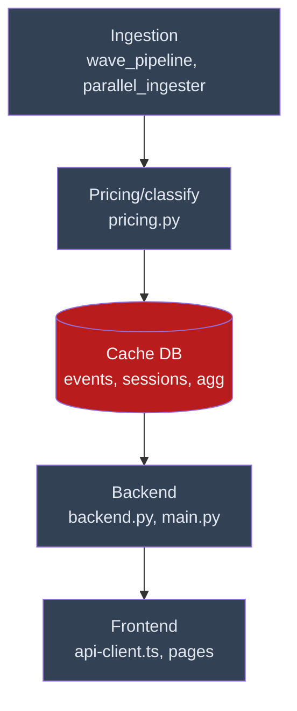
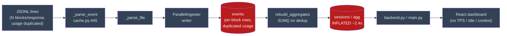
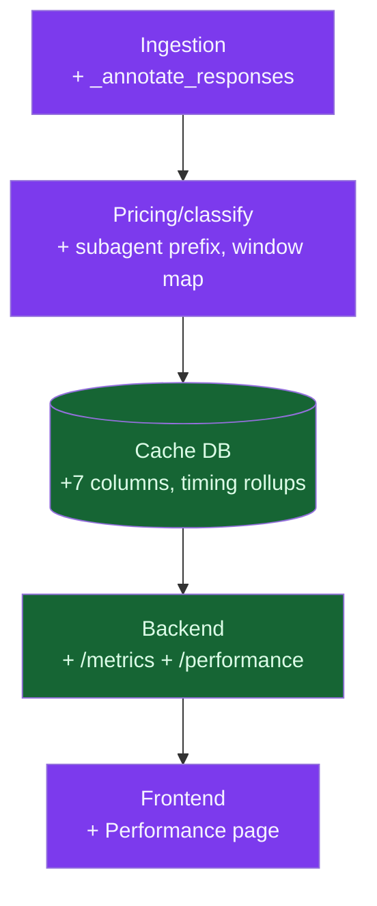
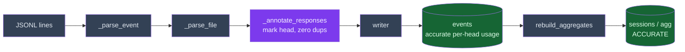
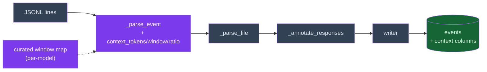

# Tokenometrics — Discovery (Current, Desired & Increments)

> - **Index:** [README.md](./README.md)

Review/background context: the architecture that motivates the gaps, not loaded during the loop.
Two lenses (component + data-flow) for each state, then one increment diagram per gap.

## Current State

The dashboard ingests `~/.claude/projects/**/*.jsonl` into a cached SQLite index. A wave pipeline
(`database/sqlite/wave_pipeline.py`) drives a `ParallelIngester`: worker threads parse files
(`CacheManager._parse_file` → `_parse_event`, `cache.py:254`/`:445`) and a single writer inserts rows
(`_write_parsed`, `cache.py:298`). Rollups (`rebuild_aggregates`, `cache.py:695`) feed the API
(`backend.py`, `main.py`) and the React app (`frontend/src/`).

Naive per-event `SUM(output_tokens)` double-counts the N content-blocks of one response (verified
≈2.44× inflation on the largest session), and there is no occupancy / TPS / idle metric anywhere.

### Current State — component lens

### Current State — data-flow lens

## Desired State

A response-aware ingestion pass corrects the counts and annotates each event; new query methods expose
the metrics; the frontend surfaces them. Same lenses, same node IDs as Current — the diff is what
changed colour.

### Desired State — component lens

### Desired State — data-flow lens

```mermaid
flowchart LR
    JSONL["JSONL lines"] --> PE["_parse_event<br/>+ context cols, subagent prefix"]
    PE --> PF["_parse_file"]
    PF --> AR["_annotate_responses<br/>mark head, zero dups,<br/>duration_ms"]
    AR --> PI["ParallelIngester writer"]
    PI --> EV[("events<br/>+7 cols, accurate<br/>per-head usage")]
    EV --> RB["rebuild_aggregates<br/>+ session timing (LEAD)"]
    RB --> SESS[("sessions / agg<br/>ACCURATE + timing")]
    SESS --> API["backend.py / main.py<br/>+ /metrics + /performance"]
    API --> FE["SessionDetail + Performance page"]
    classDef good fill:#166534,color:#dcfce7
    classDef process fill:#7c3aed,color:#f5f3ff
    classDef neutral fill:#334155,color:#e2e8f0
    class EV,SESS good
    class AR,PE process
    class JSONL,PF,PI,RB,API,FE neutral
```

## Gap Increments

One diagram per gap, in dependency order — each builds on the previous baseline (G1 extends Current
State, G2 extends G1, …). Highlighted nodes are what that gap changes; everything else is the inherited
baseline. G1 and G2 are drawn in full; G3–G8 layer on identically (each annotated below its heading).

### G1 increment
**Response-level token accounting** — extends Current State: insert `_annotate_responses` so each
requestId is counted once.

### G2 increment
**Context-window utilization annotations** — extends G1: `_parse_event` stamps
`context_tokens`/`context_window`/`context_ratio` from a curated per-model map.

### G3 increment
**Subagent message-kind prefixing** — extends G2: `_parse_event` stamps a `subagent-` prefix on the
1,335 sidechain events, so they classify correctly instead of as `human`. Same pattern: one changed
node on the G2 baseline (`PE`).

### G4 increment
**Response performance (TPS)** — extends G3: derive `tps` on each response head from
`response_duration_ms` + head output tokens. Changed node: `EV` head rows.

### G5 increment
**Turn timing (idle / active)** — extends G4: `_compute_session_timing` (LEAD window) fills
`total_idle_ms` / `total_active_ms` during `rebuild_aggregates`. Changed edge: `RB` → `SESS`.

### G6 increment
**Query layer & API endpoints** — extends G5: `backend.py` gains per-session `/metrics` and
cross-session `/performance`. Changed node: `API`.

### G7 increment
**Frontend surfacing** — extends G6: SessionDetail occupancy/TPS/idle markers + a new Performance page.
Changed node: `FE`.

### G8 increment
**Introspect-script parity** — extends G7: mirror the ingestion changes into the standalone introspect
script and parity-test. Changed node: a second copy of `ING`/`PE`/`AR` in the introspect script.
