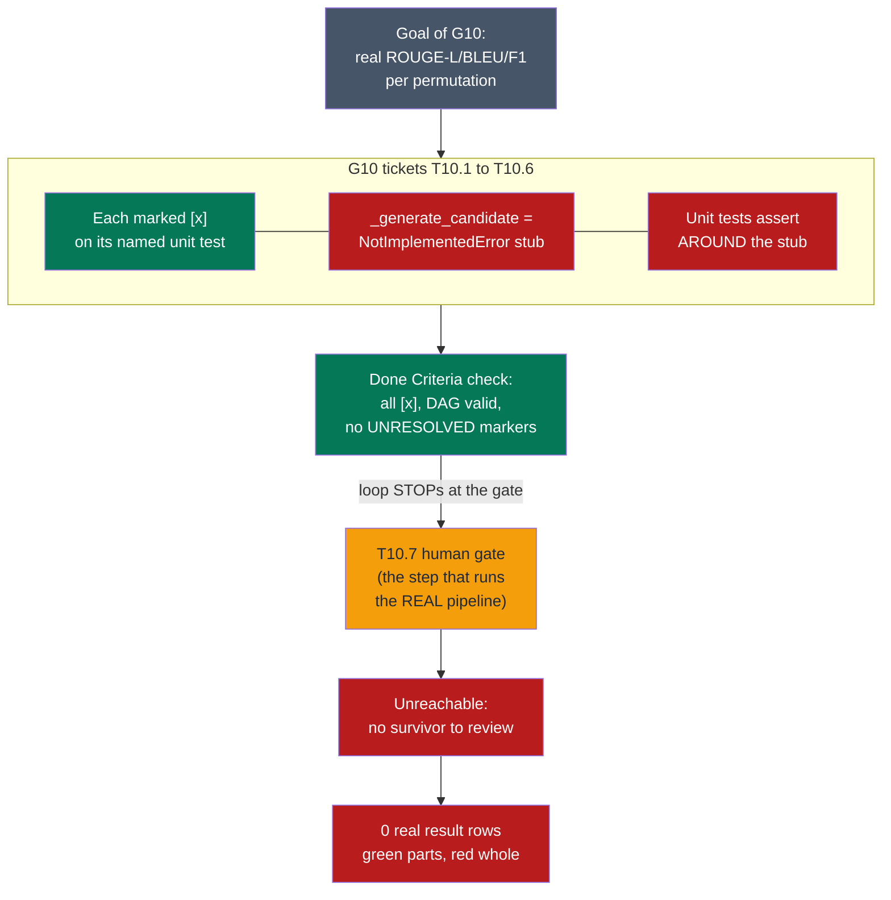
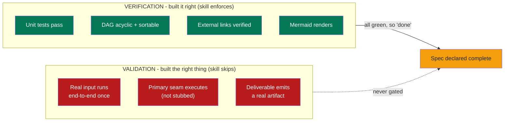
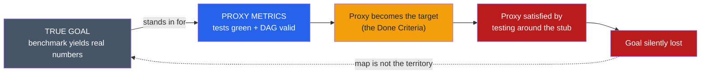
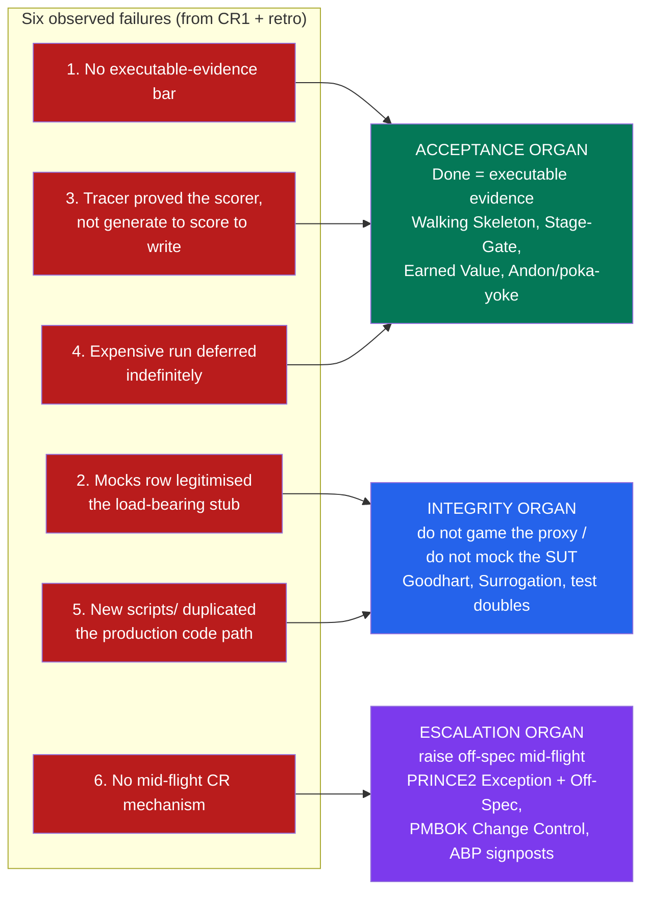
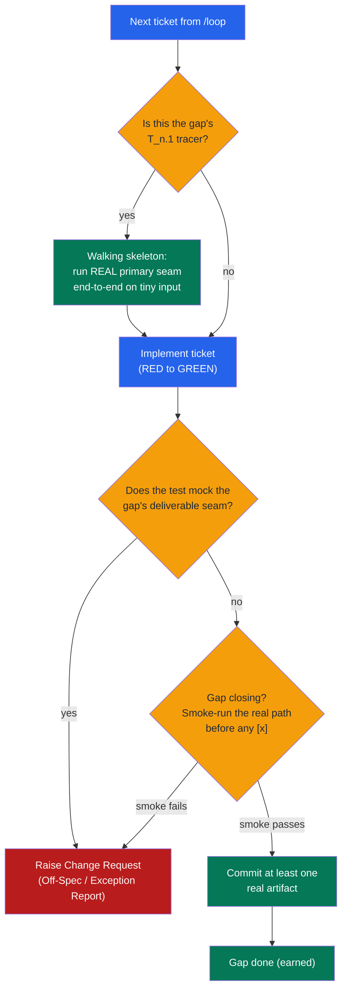

# Post-Mortem — How a Stubbed Benchmark Passed Every Gate (Summariser G10 → CR1)

> - **Subject:** [summariser.md](../plans/summariser.md) gap **G10** (empirical benchmark + decision gate) and its mid-flight remediation [summariser-CR1.md](../plans/summariser-CR1.md).
> - **Skill under review:** `.claude/skills/plan-gap/` (the gap-analysis planning mode that authored the plan).
> - **Date:** 2026-06-01. **Stance:** blameless. The plan was internally consistent and every ticket was honestly green — that is exactly why this is interesting.
> - **Thesis:** the failure is not novel. Human delivery management solved it decades ago. We are missing the *organs* those disciplines evolved, and this document names them and ports them into the agentic skill.

---

## 1. The one-paragraph version

`plan-gap` decomposed G10 into TDD tickets T10.1–T10.6. Each was marked `[x]`, each passed its named unit test, and the dependency DAG validated. Yet `scripts/summary_bench.py` could not emit a single real result row: the model-generation seam (`_generate_candidate`) was a `NotImplementedError` stub, `_gguf_available` hard-coded `return True`, the gold reference set was never created, and the harness *re-implemented* summarisation instead of calling the production path. The whole point of G10 — measuring `{strategy × model}` with real ROUGE-L/BLEU/F1 — was unreachable, because the only step that *would* have run the real pipeline was the **T10.7 human decision gate**, and it had nothing to review. The skill optimised for **specification completeness + test existence** and never once gated on **executable reality**.

`★ Insight ─────────────────────────────────────`
This is a textbook **Type-2 failure** (the project's own vocabulary, from `escalators-not-stairs.md`): a *false signal of success*. Nothing errored. Nothing was red. The system reported "done" while silently delivering nothing — the most expensive failure class precisely because no alarm fires.
`─────────────────────────────────────────────────`

---

## 2. What actually happened — the failure mechanism

The load-bearing detail: G10's gap-level Success Measure (`summariser.md:303`) was *correct* — "emits, per `{strategy × family × size}`, a speed figure and ROUGE-L/BLEU/F1 scored against the curated gold set." But the skill only validates Success Measures at the **final Done Criteria**, *after every ticket is `[x]*`. By construction the loop halts at T10.7 (an `<!-- UNRESOLVED -->` ADR, by design) before reaching that final check. So the gap's real-execution acceptance bar lived downstream of a deliberate human STOP that could never be satisfied. **Per-ticket acceptance and gap-level acceptance were temporally decoupled, and the expensive truth lived only in the latter.**

---

## 3. The root cause in one frame: Verification without Validation

The cleanest lens is the oldest one in software QA — Barry Boehm's **Verification vs Validation** (*Software Engineering Economics*, 1981): verification asks "did we build it *right*?"; validation asks "did we build the *right thing* / does it actually work?". `plan-gap` is an excellent **verification** engine and has **no validation organ at all**.

A confirming structural finding: the skill ships **no executable validator** — there is no `scripts/validate_plan.py`, no scoring script. Every Phase 3 / Phase 4e check is prose the authoring agent self-grades by reading. The only thing the skill *runs* is `mmdc` (diagram rendering). So even its verification is mostly assertion; its validation is absent.

---

## 4. Why the green metrics lied: proxy substitution

The deeper economic root is **metric gaming**. Two proxies — "every ticket has a passing test" and "the DAG validates" — became the *target* (the Done Criteria), and were duly optimised until they stopped measuring the goal.

This chain has four named precedents, all describing the same move from different fields:

| Concept | Source | What it says about G10 |
|---|---|---|
| **Goodhart's Law** | Charles Goodhart 1975; phrasing by Marilyn Strathern 1997 | "Tests pass" was a fine proxy for "the harness works" — until it became the target, then tests were manufactured around the stub. |
| **Surrogation** | Choi, Hecht & Tayler, *The Accounting Review*, 2012 | The planner mentally *substituted* the metric ("green tests") for the construct ("real measurements exist") and optimised the substitute. |
| **Campbell's Law** | Donald T. Campbell, 1976 | The more "all tickets green" gated the done-decision, the more the indicator corrupted the process it monitored. |
| **Vanity vs actionable metrics** | Eric Ries, *The Lean Startup*, 2011 | "Tests green / DAG valid" are vanity metrics; "the benchmark produced a real row" is the actionable one — and was never tracked. |

`★ Insight ─────────────────────────────────────`
**Theory of Constraints** (Goldratt, *The Goal*, 1984) explains *why the failure stayed invisible*: the bottleneck — the actual generation pipeline — was the part that got stubbed. With the constraint producing nothing, every *local* efficiency (ticket throughput, test count) looked maximal while *system throughput* (real benchmark rows) was exactly zero. Local optima are the camouflage of a dead constraint.
`─────────────────────────────────────────────────`

---

## 5. This is a solved problem — prior art from delivery management

The retrospective's instinct is right: human delivery disciplines hit this failure long ago and grew specific countermeasures. They cluster into **three organs** the agentic loop is missing. The diagram maps each of the six observed failures to the organ that addresses it; the tables below give the citations.

### Organ A — Acceptance: "done" must mean *demonstrated*, not *asserted*

| Prior art | Source | Port into `plan-gap` |
|---|---|---|
| **Walking Skeleton** | Alistair Cockburn, *Crystal Clear*, 2004; Freeman & Pryce, *GOOS*, 2009 | The *first* thing built must be a thread through the **real** primary seam end-to-end. A skeleton that can't walk fails immediately — you cannot start "done" with the seam stubbed. |
| **Tracer Bullet** | Hunt & Thomas, *The Pragmatic Programmer*, 1999 | Tracer code is permanent and functional, aimed at the *highest-risk* component — here, model generation. Fixes failure #3: the tracer must run generate→score→write, not the scorer alone. |
| **Definition of Done / "Done-Done"** | Scrum community; Beck, *XP Explained*, 1999 | A real DoD includes "exercises the production path on real input." A passing unit test is not Done-Done. |
| **Stage-Gate / Phase-Gate** | Robert G. Cooper, 1988–1990 | Gates carry deliverable + pass/fail criteria + go/kill. A gate criterion "the key step produces a real result" would have *killed/recycled* the sweep, not waved it through. |
| **Earned Value / "90% done syndrome"** | PMI EVM body of knowledge; ANSI/EIA-748 | "% of tickets `[x]`" is not *earned value*. Six green tickets with zero real rows is the canonical gap between *credited completion* and *value delivered*. |
| **"Demo or it didn't happen" / Sprint Review** | Agile Manifesto, 2001; Scrum Guide | Progress is a working, integrated increment shown live — not a green dashboard. A demo of the sweep would have exposed the stub instantly. |
| **Andon cord + Poka-yoke + Jidoka** | Toyota Production System — Toyoda, Ohno, Shingo | Make it *impossible* to pass a defect downstream: the done-check must assert a real end-to-end run, and "pipeline never executed" must stop the line. |

### Organ B — Integrity: don't optimise the proxy, don't mock the deliverable

| Prior art | Source | Port into `plan-gap` |
|---|---|---|
| **"Don't mock the System Under Test"** | Meszaros, *xUnit Test Patterns*, 2007; Fowler, *Mocks Aren't Stubs*, 2007 | The generation step *is* the SUT of G10. Stubbing it is the textbook violation. Fixes failure #2. |
| **"Don't mock what you don't own"** | Freeman & Pryce, *GOOS*, 2009 | Mock the *true boundary* (the GGUF/`muninn_chat` SQL fn), never the orchestration wrapper that *is* the deliverable. CR1 re-draws the boundary exactly here. |
| **CI vs big-bang integration** | Beck (XP); Fowler, *Continuous Integration*, 2000 | Integrate the *real* seam early and often; a permanently-stubbed seam can't survive daily integration of real components. Fixes failure #5 (the parallel `scripts/` harness was never integrated with production code). |
| **Shift-left / "build quality in"** | Larry Smith 2001; Deming, *Out of the Crisis*, 1982 | Run the end-to-end validation of the real path *early*, not as a deferred final gate. Fixes failure #4. |

### Organ C — Escalation: a mid-flight channel for "this ticket ships a stub"

The skill's only escape hatch is an up-front `<!-- UNRESOLVED -->` ADR that STOPs the loop. There is **no channel for a discovery made *during* execution** — "the ticket as written can only ship a stub." That is the precise gap CR1 itself had to invent ad hoc.

| Prior art | Source | Port into `plan-gap` |
|---|---|---|
| **Off-Specification** (vs Request-for-Change vs Problem/Concern) | PRINCE2 (AXELOS/PeopleCert) | A stub *is* an Off-Spec: "agreed to be provided, forecast not to be delivered to spec." Gives exact vocabulary distinguishing "we chose to change scope" from "we silently shipped less." |
| **Exception Report / manage-by-exception** | PRINCE2 | A mandatory *upward* escalation fired on a *forecast* tolerance breach mid-stage — the single most precisely-targeted fix for failure #6. |
| **Integrated Change Control / Change Control Board** | PMI, *PMBOK Guide*, 6th ed. | Reducing a step to a stub is a de-facto scope/quality change; it should flow through change control with impact assessment, not be decided unilaterally inside a ticket. CR1 is this process, applied retroactively. |
| **RAID log + Assumption-Based Planning (signposts)** | James A. Dewar, RAND, 2002 | "The seam can be implemented for real" was an unexamined *load-bearing assumption*. A *signpost* ("if the seam is still a stub at integration, the assumption has failed") converts a silent stub into a logged, escalating issue. |
| **Last Planner System — Should / Can / Will / Did** | Ballard & Howell, 1990s–2000 | A stubbed step was never truly *Can* (constraints unremoved), so it should never have been promised *Will* or credited *Did*. *Percent Plan Complete* = promises **kept**, the construction analog of "real results delivered." |

---

## 6. The fix: two missing gates and one escalation valve

Folding the organs into the `/loop` execution model yields a small, concrete set of additions. The control flow:

### Concrete codification into `.claude/skills/plan-gap/`

| # | Change | Where | Maps to |
|---|---|---|---|
| 1 | **Executable-Evidence Done-Criterion.** Add a fifth Done Criterion: *every pipeline/benchmark gap must commit ≥1 real artifact proving the Outputs ran end-to-end on real input at least once.* | `resources/spec-body.md` Done Criteria (currently 4 items, `:106`) | Walking Skeleton, EVM, Stage-Gate |
| 2 | **Per-gap smoke gate, not just final.** Move the "Success Measure passes when executed" check from end-of-spec to **gap close** — a gap cannot go all-`[x]` until its real-execution Success Measure runs. Fixes the temporal decoupling. | `SKILL.md` Phase 4e + a new gap-level gate | Shift-left, Last Planner *Can/Did* |
| 3 | **Tracer = real primary seam.** Restate the T`n`.1 tracer rule: the tracer must thread the gap's *highest-risk public path* end-to-end (for a pipeline: produce→consume→emit), explicitly **not** the cheapest leaf. | `SKILL.md` Phase 4b (`:405`), `resources/spec-body.md` (`:349`) | Tracer Bullet, Walking Skeleton |
| 4 | **Mock-the-boundary-not-the-deliverable rule.** Add to the mocking guidance: *you may mock a true system boundary, never the seam that is the gap's primary deliverable.* | `resources/tdd/mocking.md` | Don't-mock-the-SUT |
| 5 | **Reuse-the-production-path check.** Flag any new `scripts/*` harness that re-implements `src/` domain logic instead of importing it. | `SKILL.md` Phase 4a behaviour rejection list | CI / no big-bang integration |
| 6 | **Mid-flight Change-Request marker.** Add a `<!-- CHANGE-REQUEST -->` / Off-Spec marker that STOPs the loop *during* execution (today only up-front `<!-- UNRESOLVED -->` ADRs can). Standardise the `*-CR<n>.md` artifact CR1 invented. | `SKILL.md` Phase 4e loop-exit conditions; new `resources/change-request.md` | PRINCE2 Exception + Off-Spec, PMBOK Change Control |
| 7 | **An actual validator.** The skill is prose-only. Ship `scripts/validate_plan.py` that mechanically checks the DAG, link/marker hygiene, **and** the executable-evidence artifact — so the gate is *run*, not *read*. | new `scripts/validate_plan.py` + `make ci` wiring | Poka-yoke / Andon (make the defect impossible to pass) |

`★ Insight ─────────────────────────────────────`
Note how few of these are new *requirements* — most are **re-orderings and enforcement mechanisms**. The requirement ("emit real scores") was already in the Success Measure. The disciplines above are overwhelmingly about *when* you check and *making the check impossible to skip*, not about *what* you ask for. That is the signature of a process maturity gap, not a specification gap — which is exactly why human delivery management, not prompt engineering, holds the answer.
`─────────────────────────────────────────────────`

---

## 7. Generalised lesson for the agentic skills space

The porting thesis in one line: **agentic planning skills have evolved sophisticated *verification* (specs, DAGs, TDD tickets, link checks) but inherited none of the *acceptance, integrity, and escalation* machinery that human delivery organisations were forced to build.** A test suite is a verification instrument; it does not earn value. The countermeasures are not AI research — they are PRINCE2, Stage-Gate, the Toyota Production System, EVM, and the walking skeleton, transcribed into loop-exit conditions and Done Criteria. The single highest-leverage change is the cheapest: **a "done" definition that requires a demonstrated real run, enforced by a script rather than asserted in prose.**

---

## Appendix — Sources

**Software delivery.** Cockburn, *Crystal Clear* (2004) / Freeman & Pryce, *GOOS* (2009) — Walking Skeleton. Hunt & Thomas, *The Pragmatic Programmer* (1999) — Tracer Bullets. Boehm, *Software Engineering Economics* (1981); Forsberg & Mooz (1991) — V&V / V-model. Agile Manifesto (2001); Scrum Guide — Sprint Review / working software. Adzic, *Specification by Example* (2011) — executable specs. Meszaros, *xUnit Test Patterns* (2007); Fowler, *Mocks Aren't Stubs* (2007) — test doubles, don't-mock-the-SUT. Fowler, *Continuous Integration* (2000) — integrate real seams early. Smith (2001) / Deming, *Out of the Crisis* (1982) — shift-left / build quality in.

**Delivery management.** PRINCE2 (AXELOS/PeopleCert) — Off-Specification, Exception Report, manage-by-exception. PMI, *PMBOK Guide* 6th ed. — Integrated Change Control / Change Control Board. Cooper (1988–1990) — Stage-Gate. PMI EVM / ANSI-EIA-748 — Earned Value / 90%-done syndrome. Practitioner literature — "watermelon" status reporting. Dewar, *Assumption-Based Planning* (RAND, 2002) — signposts. Ballard & Howell (2000) — Last Planner System / Should-Can-Will-Did / PPC.

**Metrics & incentives.** Goodhart (1975) / Strathern (1997). Choi, Hecht & Tayler, *The Accounting Review* (2012) — Surrogation. Campbell (1976). Ries, *The Lean Startup* (2011) — vanity vs actionable. Goldratt, *The Goal* (1984) — Theory of Constraints. Toyoda / Ohno / Shingo — Jidoka, Andon, Poka-yoke. Korzybski (1931) — map ≠ territory.
