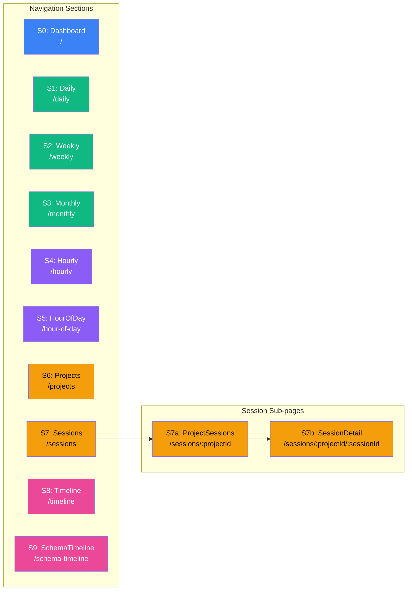
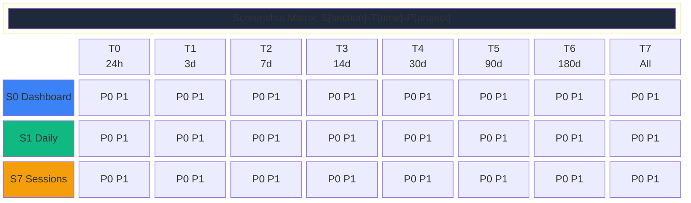
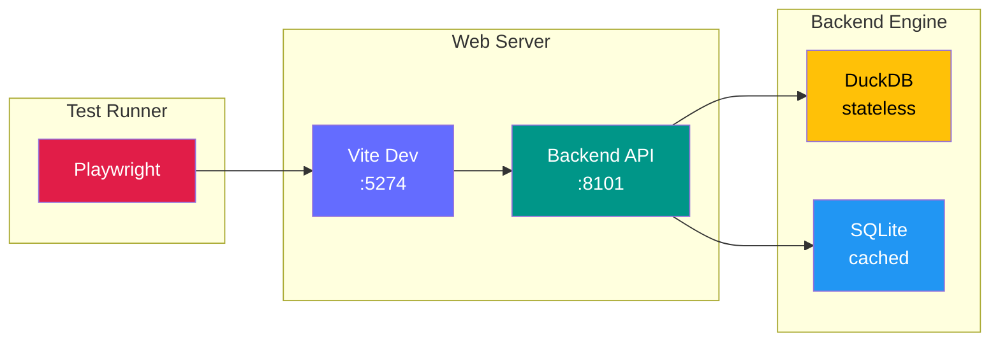

# E2E Test Suite

End-to-end tests for Claude Code Sessions Analytics using Playwright.

## Site Map



## Screenshot Naming Convention

Every filter permutation generates a screenshot using the pattern:

```
E{id}{engine}-S{id}{route_name}-T{id}{time_bucket}-P{id}.png
```

**Examples:**
- `E1sqlite-S0dashboard-T430d-P0.png` — SQLite, Dashboard, 30 days, All Projects
- `E0duckdb-S1daily-T27d-P1.png` — DuckDB, Daily, 7 days, This Project
- `E1sqlite-S7sessions-T7all-P0.png` — SQLite, Sessions, All time, All Projects

| Axis | Values |
|------|--------|
| **E** (Engine) | `0duckdb`, `1sqlite` |
| **S** (Section) | `0dashboard`, `1daily`, `2weekly`, `3monthly`, `4hourly`, `5hourofday`, `6projects`, `7sessions`, `8timeline`, `9schematimeline` |
| **T** (Time Range) | `024h`, `13d`, `27d`, `314d`, `430d`, `590d`, `6180d`, `7all` |
| **P** (Project) | `0` (All Projects), `1` (Specific Project) |

**Full matrix:** 2 engines x 10 sections x 8 time ranges x 2 project options = **320 permutations**

### Permutation Matrix



## Test Architecture



### Backend Selection

By default, **both backends run in a single test session** — Playwright starts
two server pairs (sqlite on :8101/:5274, duckdb on :8102/:5275) and runs every
test against both. Screenshots and logs are engine-prefixed for comparison.

```bash
# Both engines (default — full coverage)
make test-frontend-e2e

# Single engine (faster iteration)
make test-frontend-e2e-sqlite
make test-frontend-e2e-duckdb
```

## Test Files

| File | Scope | Tests |
|------|-------|-------|
| `filters.spec.ts` | Universal filters across all sections | Section loading, filter permutations, URL params, API verification |
| `project-sessions-sort.spec.ts` | `/sessions/:projectId` sorting | Column sort, URL deep-links, sort persistence |
| `session-detail-filter.spec.ts` | `/sessions/:projectId/:sessionId` message filter | Kind dropdown, URL params, deep-links |

## Global Filters

Every page shares two global filters managed by `useFilters` hook:

| Filter | URL Param | Default | Behavior |
|--------|-----------|---------|----------|
| Time Range | `?days=N` | 30 (omitted from URL) | 1, 3, 7, 14, 30, 90, 180, 0 (all) |
| Project | `?project=ID` | All (omitted from URL) | Encoded project ID |

Page-local filters (sort, message kind) are managed by individual components
and do NOT leak into sidebar navigation links.

## Running Tests

```bash
# Run all e2e tests
make test-frontend-e2e

# Run with Playwright UI (interactive debugging)
npm --prefix frontend run test:e2e:ui

# Run specific test file
npx --prefix frontend playwright test e2e/filters.spec.ts

# Run with headed browser (watch mode)
npx --prefix frontend playwright test --headed
```
